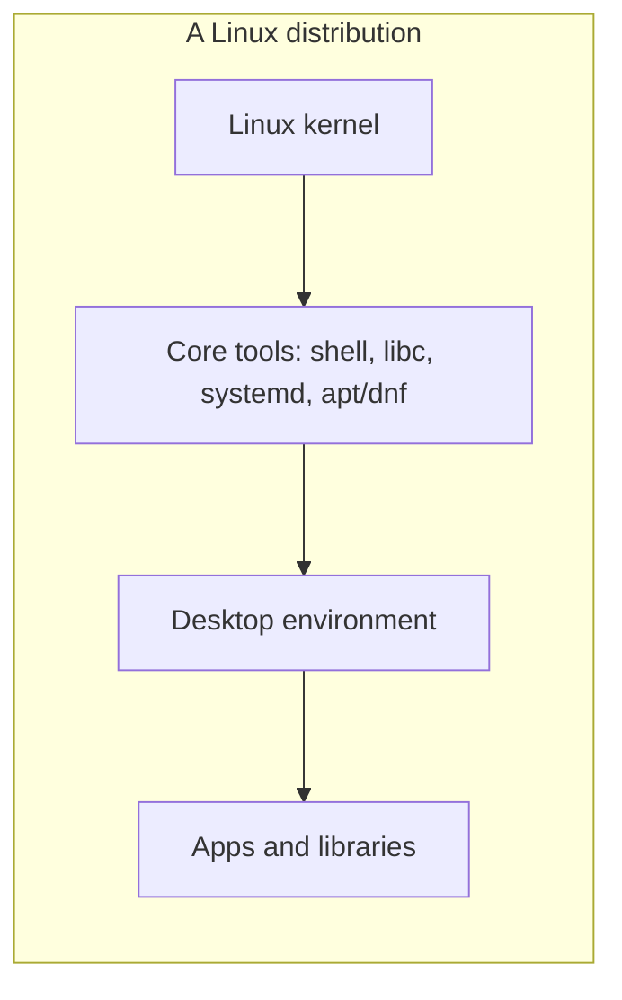
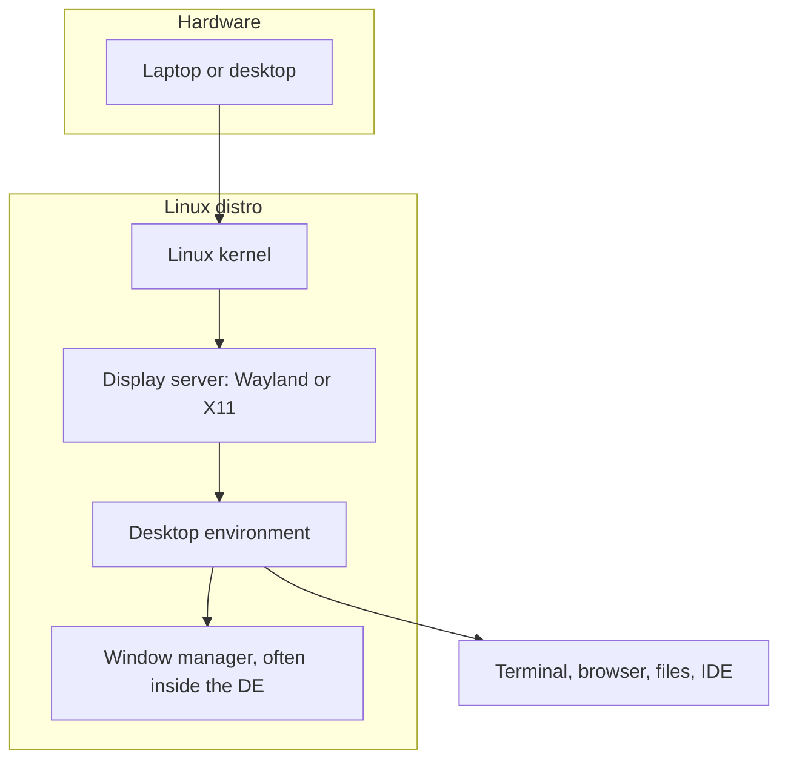

# 1. Basics of Linux

[← Home](../README.md) · [How Linux is put together →](02-linux-design.md)

Linux is not one product. It is a **kernel** (the bit that talks to hardware) plus a **buffet of software** that a *distribution* packages into something you can install. People say "I run Linux" the way people say "I drive a car." They usually mean a specific distro, desktop, and set of habits.

If you only remember one thing from this page: **pick a distro, install it, then learn the shell.** Distro-hopping is a hobby. Programming is the homework.

## Why CS students end up on Linux

- Course staff, cloud VMs, and internships assume POSIX tools: `ssh`, `git`, `make`, compilers, Python, databases.
- Most servers you will ever deploy to are Linux. Developing on the same family of OS removes a whole class of "works on my machine" bugs.
- The command line is not optional in systems, networks, security, or DevOps courses. Start here: [amitsk/learning-shell](https://github.com/amitsk/learning-shell).

Windows and macOS are fine computers. Linux is the one that matches the machines you are training for.

## Distro, desktop, packages — three words, three jobs



| Piece | Job | Example |
| --- | --- | --- |
| **Kernel** | Talks to CPU, RAM, disks, network cards | Linux |
| **Userland tools** | Shell, compilers, init, package manager | GNU coreutils, `bash`, `apt` / `dnf` |
| **Desktop environment** | Windows, panels, settings, file manager | Cinnamon, GNOME, XFCE, Budgie |
| **Distribution** | Chooses versions, adds an installer, ships updates | Fedora, Ubuntu, Linux Mint |

A distro is a **curated bundle**. Same kernel family, different opinions about defaults. [Section 2](02-linux-design.md) unpacks the design. This section is about choosing the bundle.

## Three distros worth knowing

You only need to *install* one. You should *recognize* these three, because they show up in class, internships, and "please help my laptop" group chats.

### Linux Mint — the recommended first desktop

[Linux Mint](https://linuxmint.com/) is Ubuntu-based, ships a familiar desktop, and does not try to reinvent the taskbar every six months. **Cinnamon edition** is the one this tutorial installs in [section 3](03-dev-workstation.md).

- Downloads: [linuxmint.com/download.php](https://linuxmint.com/download.php)
- Installer: [Linux Mint Installation Guide](https://linuxmint-installation-guide.readthedocs.io/en/latest/)
- Editions: **Cinnamon** (default, polished), **MATE** (lighter classic), **XFCE** (lightest official edition)

Mint is the "I want this to feel like a normal computer" option. That is a feature, not a lack of street cred.

### Ubuntu — the one the internet assumes you have

[Ubuntu](https://ubuntu.com/) is Debian-based, extremely well documented, and the default answer when a README says "on Linux." Default desktop is **GNOME**. Flavors swap the desktop without leaving the Ubuntu family.

- Desktop install tutorial: [Install Ubuntu desktop](https://ubuntu.com/tutorials/install-ubuntu-desktop)
- Flavors: [Ubuntu flavors](https://ubuntu.com/desktop/flavours)
  - [Ubuntu Desktop](https://ubuntu.com/desktop) — GNOME
  - [Xubuntu](https://xubuntu.org/) — XFCE
  - [Ubuntu Budgie](https://ubuntubudgie.org/) — Budgie
- Server (no GUI, typical for VMs): [Ubuntu Server](https://ubuntu.com/download/server)

If a cloud assignment, Docker doc, or internship laptop image says Ubuntu, this is why.

### Fedora — the one that lives closer to upstream

[Fedora](https://fedoraproject.org/) is sponsored by Red Hat and ships newer kernels, GNOME, and toolchains sooner than Ubuntu/Mint. Package manager is **DNF**, not APT. Excellent if you want to see "what Linux looks like six months from now."

- Workstation download: [Fedora Workstation](https://fedoraproject.org/workstation/download)
- Install guide: [Fedora getting started](https://docs.fedoraproject.org/en-US/fedora/latest/getting-started/)
- Other desktops: [Fedora Spins](https://fedoraproject.org/spins/), including [Fedora XFCE](https://fedoraproject.org/spins/xfce/) and [Fedora Budgie](https://fedoraproject.org/spins/budgie/)

Fedora is a great *second* distro. Learn Mint or Ubuntu first so `apt` muscle memory exists, then try Fedora when you are bored of being comfortable.

### Quick comparison

| | **Linux Mint** | **Ubuntu** | **Fedora** |
| --- | --- | --- | --- |
| Family | Ubuntu / Debian | Debian | Red Hat |
| Packages | `apt` | `apt` | `dnf` |
| Default desktop | Cinnamon | GNOME | GNOME |
| Release feel | Stable, conservative | LTS + interim | Fresh, ~6 month cadence |
| Best first use | Daily driver, older laptops | Class / cloud familiarity | Upstream and newer hardware |
| Official start | [Download Mint](https://linuxmint.com/download.php) | [Install Ubuntu](https://ubuntu.com/tutorials/install-ubuntu-desktop) | [Fedora Workstation](https://fedoraproject.org/workstation/download) |

There are hundreds of other distros. Arch, openSUSE, Debian, NixOS, and friends are all real. They are not your first desktop unless you enjoy installing a Wi-Fi driver as a personality.

## Desktop flavors: XFCE, GNOME, Budgie (and Cinnamon)

The **desktop environment (DE)** is the GUI: panel, app menu, window decorations, settings. Same distro, different DE, wildly different vibe. Think "same kitchen, different cabinets."



### GNOME

[GNOME](https://www.gnome.org/) is the default on Ubuntu Desktop and Fedora Workstation. Overview screen, extensions, a "this is a modern desktop" design language. Powerful, polished, and occasionally allergic to title-bar buttons you grew up with.

Use GNOME if you want the mainstream Ubuntu/Fedora experience.

### XFCE

[XFCE](https://www.xfce.org/) is light, traditional, and kind to old laptops. Panels, a menu, not much animation. Ships as **Xubuntu**, Mint XFCE, and a [Fedora XFCE Spin](https://fedoraproject.org/spins/xfce/).

Use XFCE if the machine is used, RAM is tight, or you want the UI to stay out of the way. See [Used laptops](04-used-laptops.md).

### Budgie

[Budgie](https://buddiesofbudgie.org/) is a clean, Raven-sidebar desktop. On Ubuntu it is [Ubuntu Budgie](https://ubuntubudgie.org/). Fedora has offered Budgie as a spin / atomic desktop depending on the release — check the current [Fedora spins](https://fedoraproject.org/spins/) page.

Use Budgie if you want something prettier than XFCE and less "GNOME overview" than GNOME.

### Cinnamon (this tutorial's default)

[Cinnamon](https://github.com/linuxmint/cinnamon) is Mint's flagship: start menu, system tray, workspaces, a layout Windows/macOS refugees recognize in under a minute. That is why [section 3](03-dev-workstation.md) uses **Linux Mint Cinnamon edition**.

You can install other DEs later with the package manager. Do not do that on day one. Get one desktop working, then customize.

## You still need the terminal

The GUI is for living. The shell is for *working*. CS coursework will not accept a screenshot of the file manager as a build log.

Start here, in this order:

1. [Getting started with the Unix shell](https://github.com/amitsk/learning-shell/blob/main/scripts/getting_started.md) — setup, first script, SSH keys
2. [Text editors on the command line](https://github.com/amitsk/learning-shell/blob/main/scripts/text_editors.md) — nano, Vim, and how to exit Vim
3. [Bash basics](https://github.com/amitsk/learning-shell/blob/main/scripts/basic_shell.md) and [Bash tools](https://github.com/amitsk/learning-shell/blob/main/scripts/tools_bash.md)
4. [Users and groups](https://github.com/amitsk/learning-shell/blob/main/scripts/users_groups.md) — you will use this in [section 3](03-dev-workstation.md)

The rest of [learning-shell](https://github.com/amitsk/learning-shell) (sed, awk, HTTP tools, Make) can wait until you have a machine and a prompt.

### Five commands that unlock the rest

Run these after install. Meanings live in the shell tutorial; this is just the "you are not stuck" kit.

```bash
pwd          # where am I?
ls -la       # what is here, including hidden files?
cd ~         # go home
man ls       # the manual; q to quit
sudo apt update   # on Mint/Ubuntu: refresh package lists
```

On Fedora, the last line is `sudo dnf upgrade --refresh`. Different grocery store, same idea.

## Ways to run Linux without drama

| Approach | When to use it | Tradeoff |
| --- | --- | --- |
| **Dedicated install** (this tutorial) | You have a spare/used laptop, or you are ready to make Linux the main OS | Cleanest driver story; you own the machine |
| **Dual boot** | You still need Windows/macOS for one app | Works; disk partitioning is the scary part. Follow the distro's official installer, take backups |
| **Virtual machine** | You cannot touch the host disk yet | Safe playground, slower, worse GPU. [VirtualBox](https://www.virtualbox.org/) or [virt-manager](https://virt-manager.org/) |
| **WSL2 on Windows** | Your only computer is a locked-down Windows laptop | Great for shell + compilers, *not* a full Linux desktop. See [learning-shell getting started](https://github.com/amitsk/learning-shell/blob/main/scripts/getting_started.md) |

If the goal is "learn Linux as a desktop," install it on real hardware. A used ThinkPad from [section 4](04-used-laptops.md) beats a sluggish VM for morale.

## Package managers in one paragraph

Software on Linux does not start with a random installer `.exe`. You ask the distro's **package manager** for a package, it pulls a signed build, and updates flow through the same pipe.

- Mint / Ubuntu: **APT** — `apt update`, `apt install`, `apt upgrade`. Full walkthrough in [section 3](03-dev-workstation.md).
- Fedora: **DNF** — `dnf install`, `dnf upgrade`. Docs: [DNF on Fedora](https://docs.fedoraproject.org/en-US/quick-docs/dnf/).

There are also **Flatpak** (Mint loves this), **Snap** (Ubuntu loves this), and language-level tools (`pip`, `npm`, `cargo`). Distro packages first; random scripts from blogs later, and only after you read them.

## What "flavor" should *you* install?

**Default recommendation:** [Linux Mint Cinnamon](https://linuxmint.com/download.php).

Choose something else only if:

- The laptop is ancient and sad → Mint **XFCE** or [Xubuntu](https://xubuntu.org/)
- A course or cloud image is Ubuntu-shaped → [Ubuntu Desktop](https://ubuntu.com/desktop) (GNOME) or [Ubuntu Budgie](https://ubuntubudgie.org/)
- You want newer packages and GNOME as upstream sees it → [Fedora Workstation](https://fedoraproject.org/workstation/download)

Then stop shopping. An installed OS teaches more than a spreadsheet of distro logos.

## Extra reading (still beginner-friendly)

- [Linux Journey](https://linuxjourney.com/)
- [MIT Missing Semester](https://missing.csail.mit.edu/)
- [The Linux Documentation Project](https://tldp.org/guides.html)
- [DigitalOcean Linux basics](https://www.digitalocean.com/community/tags/linux-basics)

---

**Next:** [How Linux is put together →](02-linux-design.md)
