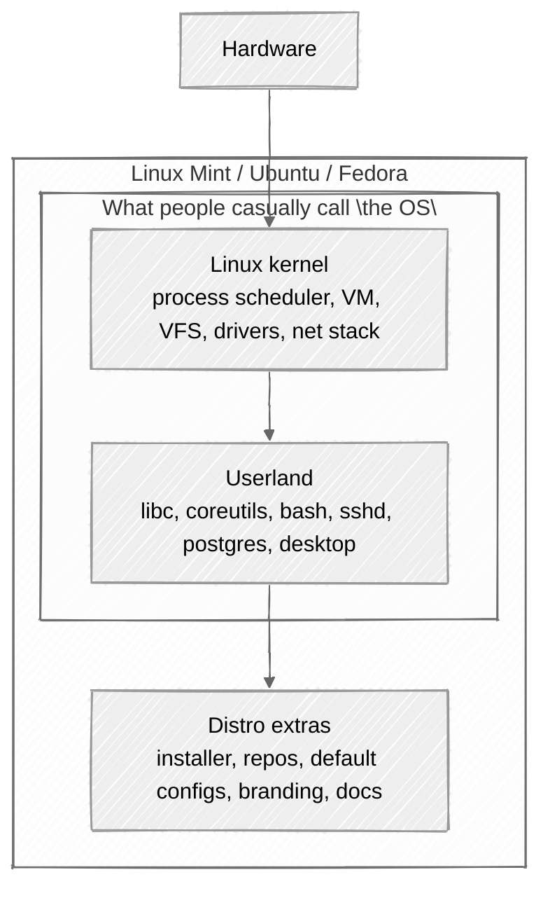
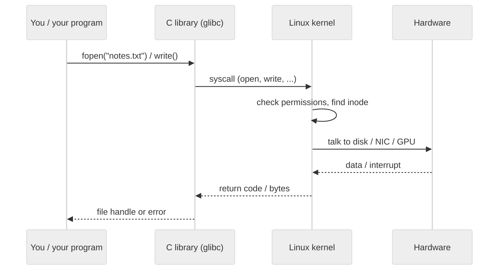
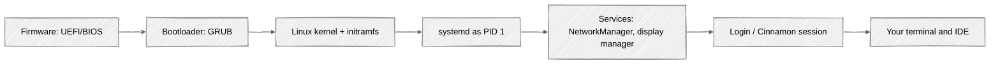
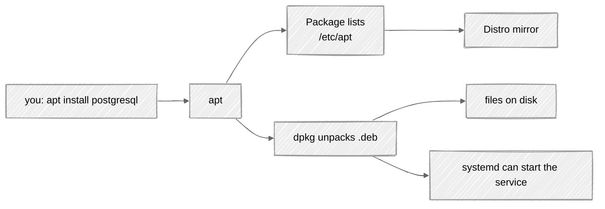

# 2. How Linux is put together

[← Basics of Linux](01-linux-basics.md) · [Home](../README.md) · [Choosing a distribution →](03-linux-distributions.md)

Linux is a **kernel**. Ubuntu, Fedora, and Mint are **distributions**: the kernel plus a pile of user-space programs, installation tools, an optional desktop, and a promise to ship updates. Confusing the two is how you get into arguments that eat an entire lab session.

This section is the mental model. You do not need to compile a kernel. You do need to know which layer is on fire when something breaks.

## The one-sentence design

> Linux is a kernel. A distro is that kernel **bundled** with GNU (and other) tools, a service manager, a package manager, and, for desktop editions, a graphical environment.

```text
+--------------------------------------------------+
|  Apps: browser, VS Code, psql, your homework     |
+--------------------------------------------------+
|  Desktop: Cinnamon / GNOME / XFCE / Budgie       |
+--------------------------------------------------+
|  Userland tools: bash, coreutils, ssh, apt/dnf   |
|  libraries: glibc, OpenSSL, ...                  |
+--------------------------------------------------+
|  Service manager: systemd                        |
+--------------------------------------------------+
|  Linux kernel: processes, memory, drivers, net   |
+--------------------------------------------------+
|  Hardware: CPU, RAM, disk, GPU, Wi-Fi            |
+--------------------------------------------------+
```

The kernel is the landlord. Everything above it is a tenant that asks politely (via **system calls**) to read a file, open a socket, or map memory.

## Kernel vs operating system vs distro



| Term | What it actually is |
| --- | --- |
| **Linux** (strict) | The kernel: [kernel.org](https://kernel.org/) |
| **GNU/Linux** | Kernel + GNU userland (`bash`, `ls`, `gcc`, glibc). The old naming fight. Both names are used; the software is the same idea |
| **Distribution** | Someone's recipe: which kernel version, which packages, which desktop, how updates work |
| **Desktop environment** | GUI shell on top of that recipe. See [chapter 3](03-linux-distributions.md) |

Mint, Ubuntu, and Fedora all run *a* Linux kernel. They disagree about package format (`.deb` vs `.rpm`), release cadence, and which settings ship out of the box.

## What the kernel actually does

The kernel is not a desktop. It does not know what a "Start menu" is. It does this:

- **Processes and scheduling** — many programs, one CPU (or a few cores). Time-slicing so your editor and compiler can coexist.
- **Virtual memory** — each process thinks it owns the address space. The kernel maps that onto RAM and swap.
- **Device drivers** — Wi-Fi chip, NVMe disk, USB, GPU. This is why a distro's *kernel version* matters on weird laptops.
- **Filesystems** — ext4, XFS, Btrfs, and the virtual `/proc` and `/sys` trees.
- **Networking** — sockets, routing, firewall hooks (which **UFW** later uses).
- **Security boundaries** — users, groups, capabilities, namespaces. Containers are kernel features wearing a nice API.

User programs never poke the disk controller directly (if they are well-behaved). They call `read()`, `write()`, `mmap()`, `clone()`, … and the kernel does the privileged work.



When a command "fails with Permission denied," that is usually the kernel enforcing a rule, not the shell being rude. Users and groups are covered in [learning-shell: users and groups](https://github.com/amitsk/learning-shell/blob/main/scripts/users_groups.md) and practiced in [section 5](05-dev-workstation.md).

## Userland: the "tooling" in "kernel bundled with tooling"

If you installed *only* a kernel, you would have a very expensive brick. The distro therefore ships **userland**:

| Bundle | Examples | Why it exists |
| --- | --- | --- |
| **C library** | glibc | Programs need `printf`, threads, DNS lookups |
| **Core utilities** | `ls`, `cp`, `grep`, `ps` ([GNU coreutils](https://www.gnu.org/software/coreutils/)) | The Unix toolbox |
| **Shell** | `bash`, sometimes `zsh` | You type here. Tutorial: [learning-shell](https://github.com/amitsk/learning-shell) |
| **Init / services** | [systemd](https://systemd.io/) | Starts `sshd`, PostgreSQL, your desktop, in the right order |
| **Package manager** | `apt` / `dpkg` or `dnf` / `rpm` | Install and update without downloading zip files from 2011 |
| **Desktop stack** | display server + DE | Windows, panels, settings |
| **Daemons you will set up** | OpenSSH, UFW, PostgreSQL | The workstation half of this tutorial |

"GNU/Linux" is this split in a name: GNU tools + Linux kernel. Distros also add a lot that is *not* GNU (systemd, LLVM, Firefox, Cinnamon, Flatpak). The slogan is historical; the architecture is "kernel in ring 0, everything else as processes."

The stack above describes this tutorial's desktop distributions. Embedded systems and container images can use different libraries or service tools, and often omit the desktop entirely.

## Boot: from firmware to a desktop

Knowing the boot path helps the first time a machine stops at a black screen and you have to guess which layer died.



1. **UEFI/BIOS** initializes hardware. This is where Secure Boot and "boot from USB" live. Relevant on [used laptops](07-used-laptops.md).
2. **GRUB** (usually) loads the kernel and an **initramfs** (tiny root filesystem for finding the real disk).
3. The **kernel** takes over, mounts the real root filesystem.
4. **systemd** becomes process 1 and starts units: networking, `sshd`, `postgresql`, the display manager (`lightdm` on Mint Cinnamon).
5. You log in. The DE is just another set of user processes.

`systemctl status` is how you ask systemd "is this service alive?" You will use it for SSH and PostgreSQL in [section 5](05-dev-workstation.md).

## Processes, files, and the "everything is a file" joke

Unix-like systems treat a lot of things as file descriptors: files, pipes, sockets, terminals.

```text
your shell (bash)
   │
   ├── child: ls          → writes to stdout (the terminal)
   ├── child: gcc         → reads .c files, writes a binary
   └── child: psql        → socket to postgres (another process)
                              │
                              └── postgres worker
                                    └── kernel: files, RAM, TCP
```

Useful consequences:

- Pipes (`cmd1 | cmd2`) are kernel plumbing. Practice in [learning-shell](https://github.com/amitsk/learning-shell).
- Permissions are on files (and directories). `/etc` is config; `/home/you` is yours; `/var/lib/postgresql` is the database's house.
- On these distros, systemd manages services through units; restarting a failed process depends on the unit's configuration.

The filesystem layout is documented in `man hier` and the [Filesystem Hierarchy Standard](https://refspecs.linuxfoundation.org/FHS_3.0/fhs/index.html). Short version:

| Path | Typical contents |
| --- | --- |
| `/bin`, `/usr/bin` | Programs (`ls`, `python3`, `git`) |
| `/etc` | System configuration |
| `/home` | User homes |
| `/var` | Logs, databases, things that change |
| `/tmp` | Scratch; do not store homework here |
| `/proc`, `/sys` | Kernel-exported info, not a real disk |

## Package management is part of the design

A distro's superpower is not the wallpaper. It is a **signed repository** of packages that were built to work together.



- **Mint / Ubuntu:** `apt` talks to repos, `dpkg` unpacks `.deb` files. Details in [section 5 — apt](05-dev-workstation.md#53-apt-the-grocery-store).
- **Fedora:** `dnf` + `rpm`. Same idea, different file format.

That is why "curl a random installer" is the exception, not the default. The bundle is the product.

## Privileges: root, sudo, and why you should not live as root

The kernel distinguishes **UID 0** (root) from everyone else. Root can install kernels and destroy disks with equal efficiency.

Desktop distros give your first user **sudo** — permission to run *one command* as root, with an audit trail. Use it for `apt`, `systemctl`, `ufw`, and user management. Do daily coding as a normal user. PostgreSQL will even refuse to run as root, which is the database equivalent of "I'm not sitting in the splash zone."

## What to do with this model

You now have enough architecture to follow [section 5](05-dev-workstation.md) without treating every command as a magic spell:

| Symptom | Likely layer |
| --- | --- |
| Machine never reaches GRUB | Firmware / disk / USB stick |
| GRUB, then kernel panic | Kernel, initramfs, or the root disk |
| Text login, no desktop | Display manager / DE |
| Desktop fine, `apt` fails | Network or repositories |
| `Permission denied` | Users, groups, file mode |
| Browser works, `sshd` does not | systemd unit or UFW |

Deeper dives, when you want them:

- [Linux Journey](https://linuxjourney.com/) — kernel, boot, networking, in small pages
- [Missing Semester: the shell](https://missing.csail.mit.edu/2020/course-shell/)
- [kernel.org](https://kernel.org/) — you do not need to compile this on day one. Really.

---

**Next:** [Choosing a Linux distribution →](03-linux-distributions.md)
