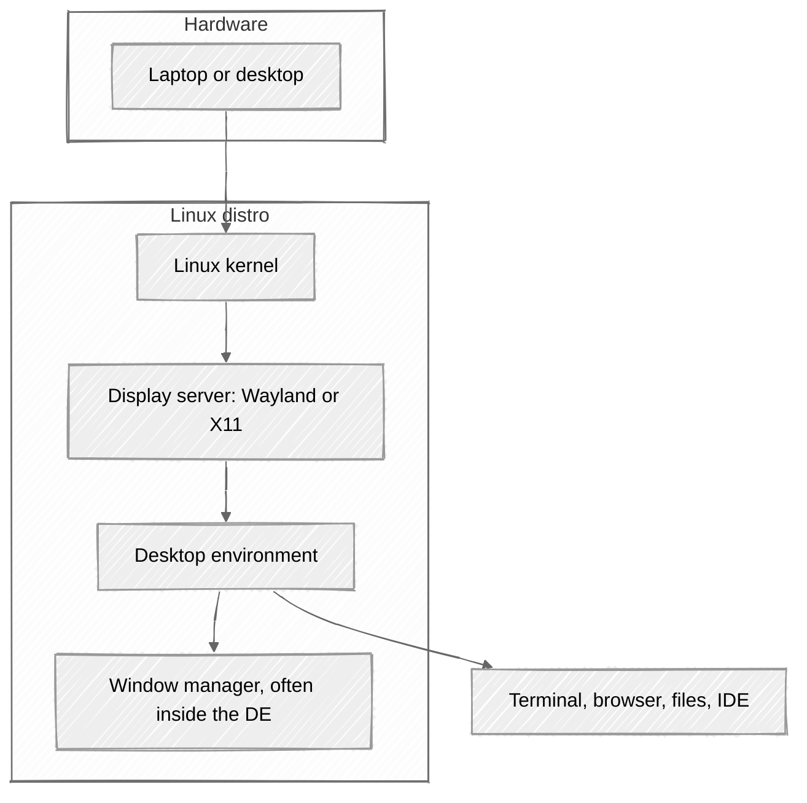

# 3. Choosing a Linux distribution

[← How Linux is put together](02-linux-design.md) · [Home](../README.md) · [Running Linux: VMs and containers →](04-running-linux.md)

A distribution turns the Linux kernel and user-space software into an installable, maintained system. Choosing one means choosing its packages, update policy, support, and defaults. Start with Linux Mint Cinnamon for this tutorial, or use the distro your course requires.

## Three distros worth knowing

You only need to *install* one. You should *recognize* these three, because they show up in class, internships, and "please help my laptop" group chats.

### Linux Mint — the recommended first desktop

[Linux Mint](https://linuxmint.com/) is Ubuntu-based, ships a familiar desktop, and does not try to reinvent the taskbar every six months. **Cinnamon edition** is the one this tutorial installs in [section 5](05-dev-workstation.md).

- Downloads: [linuxmint.com/download.php](https://linuxmint.com/download.php)
- Installer: [Linux Mint Installation Guide](https://linuxmint-installation-guide.readthedocs.io/en/latest/)
- Editions: **Cinnamon** (default, polished), **MATE** (lighter classic), **XFCE** (lightest official edition)

Mint is the "I want this to feel like a normal computer" option. That is a feature, not a lack of street cred.

### Ubuntu — and the Debian foundation

[Debian](https://www.debian.org/intro/about) is a community-run distribution and an upstream foundation for many others. It brings together the Linux kernel, core libraries, command-line tools, and a large package archive. Its `.deb` format, `dpkg` package installer, and APT dependency and repository tools form the packaging foundation inherited by Ubuntu. Debian's stable releases emphasize tested combinations of software.

[Ubuntu](https://ubuntu.com/) builds on Debian's work, with Canonical and its community maintaining their own repositories, integration, releases, and security updates. Ubuntu is a [Debian derivative](https://www.debian.org/derivatives/), not simply Debian with a different wallpaper. **LTS** means long-term support; these releases suit a workstation you want to keep through several semesters. The default Ubuntu desktop uses **GNOME**, while flavors offer other desktops. See [Ubuntu's release cycle](https://ubuntu.com/about/release-cycle).

The family relationship for the main Mint edition is **Debian → Ubuntu → Linux Mint**. That explains why this tutorial's APT commands transfer well between them. It does **not** mean their repositories or arbitrary `.deb` packages can be mixed: use instructions for your exact distro and release. Mint also offers [LMDE](https://linuxmint.com/download_lmde.php), a separate edition based directly on Debian.

- Desktop install tutorial: [Install Ubuntu desktop](https://ubuntu.com/tutorials/install-ubuntu-desktop)
- Flavors: [Ubuntu flavors](https://ubuntu.com/desktop/flavours)
  - [Ubuntu Desktop](https://ubuntu.com/desktop) — GNOME
  - [Xubuntu](https://xubuntu.org/) — XFCE
  - [Ubuntu Budgie](https://ubuntubudgie.org/) — Budgie
- Server (no GUI, typical for VMs): [Ubuntu Server](https://ubuntu.com/download/server)

If a cloud assignment, Docker doc, or internship laptop image says Ubuntu, this is why.

### Fedora — the one that lives closer to upstream

[Fedora](https://fedoraproject.org/) is sponsored by Red Hat and generally ships newer kernels, GNOME, and toolchains than Ubuntu LTS or Mint. Its package manager is **DNF**. Its faster release cycle suits readers who want recent software and are comfortable upgrading more frequently.

- Workstation download: [Fedora Workstation](https://fedoraproject.org/workstation/download)
- Install guide: [Fedora getting started](https://docs.fedoraproject.org/en-US/fedora/latest/getting-started/)
- Other desktops: [Fedora Spins](https://fedoraproject.org/spins/), including [Fedora XFCE](https://fedoraproject.org/spins/xfce/) and [Fedora Budgie](https://fedoraproject.org/spins/budgie/)

Fedora can also be a first distro, especially when a course requires it or newer hardware benefits from its software stack. This tutorial uses Mint, so translate the package-management steps using the Fedora notes.

### Quick comparison

| | **Linux Mint** | **Ubuntu** | **Fedora** |
| --- | --- | --- | --- |
| Family | Ubuntu / Debian | Debian | Red Hat |
| Packages | `apt` | `apt` | `dnf` |
| Default desktop | Cinnamon | GNOME | GNOME |
| Release feel | Stable, conservative | LTS + interim | Fresh, ~6 month cadence |
| Best first use | Daily driver, older laptops | Class / cloud familiarity | Upstream and newer hardware |
| Official start | [Download Mint](https://linuxmint.com/download.php) | [Install Ubuntu](https://ubuntu.com/tutorials/install-ubuntu-desktop) | [Fedora Workstation](https://fedoraproject.org/workstation/download) |

Explore [DistroWatch](https://distrowatch.com/) for distribution summaries, release news, and links to project websites. Its page-hit ranking measures interest on that site, not installed market share or quality. Debian, Arch, openSUSE, and NixOS offer other approaches; compare their installation and maintenance requirements before choosing.

## Desktop flavors: XFCE, GNOME, Budgie (and Cinnamon)

The **desktop environment (DE)** is the GUI: panel, app menu, window decorations, settings. Same distro, different DE, wildly different vibe. Think "same kitchen, different cabinets."

### Cinnamon (this tutorial's default)

[Cinnamon](https://github.com/linuxmint/cinnamon) is Mint's flagship: start menu, system tray, workspaces, a layout Windows/macOS refugees recognize in under a minute. That is why [section 5](05-dev-workstation.md) uses **Linux Mint Cinnamon edition**.

You can install other DEs later with the package manager. Do not do that on day one. Get one desktop working, then customize.

### GNOME

[GNOME](https://www.gnome.org/) is the default on Ubuntu Desktop and Fedora Workstation. Overview screen, gestures, a "this is a modern desktop" design language. Powerful, polished, and occasionally allergic to minimize buttons you grew up with.

Use GNOME if you want the mainstream Ubuntu/Fedora experience.

### XFCE

[XFCE](https://www.xfce.org/) is light, traditional, and kind to old laptops. Panels, a menu, not much animation. Ships as **Xubuntu**, Mint XFCE, and a [Fedora XFCE Spin](https://fedoraproject.org/spins/xfce/).

Use XFCE if the machine is used, RAM is tight, or you want the UI to stay out of the way. See [Used laptops](07-used-laptops.md).

### Budgie

[Budgie](https://buddiesofbudgie.org/) is a clean, Raven-sidebar desktop. On Ubuntu it is [Ubuntu Budgie](https://ubuntubudgie.org/). Fedora has offered Budgie as a spin / atomic desktop depending on the release — check the current [Fedora spins](https://fedoraproject.org/spins/) page.

Use Budgie if you want something prettier than XFCE and less "GNOME overview" than GNOME.

## Package managers in one paragraph

Software on Linux does not start with a random installer `.exe`. You ask the distro's **package manager** for a package, it pulls a signed build, and updates flow through the same pipe.

- Mint / Ubuntu: **APT** — `apt update`, `apt install`, `apt upgrade`. Full walkthrough in [section 5](05-dev-workstation.md).
- Fedora: **DNF** — `dnf install`, `dnf upgrade`. Docs: [DNF on Fedora](https://docs.fedoraproject.org/en-US/quick-docs/dnf/).

There are also **Flatpak** (Mint loves this), **Snap** (Ubuntu loves this), and language-level tools (`uv`, `cargo`, `npm`). Distro packages first; random scripts from blogs later, and only after you read them.

## What "flavor" should *you* install?

**Default recommendation:** [Linux Mint Cinnamon](https://linuxmint.com/download.php).

Choose something else only if:

- The laptop is ancient and tired → Mint **XFCE** or [Xubuntu](https://xubuntu.org/)
- A course or cloud assignment is explicitly Ubuntu-shaped → [Ubuntu Desktop](https://ubuntu.com/desktop) (GNOME) or [Ubuntu Budgie](https://ubuntubudgie.org/)
- You want newer packages and GNOME as upstream sees it → [Fedora Workstation](https://fedoraproject.org/workstation/download)

Then stop shopping. An installed OS teaches more than a spreadsheet of distro logos.

## Industry context: Distributions made by cloud providers

When you enter industry or launch cloud VMs, you will notice major cloud providers maintain their own Linux distributions. These focus strictly on server and container workloads; **they deliberately omit the desktop environment** you want on a student workstation.

| Provider | Distribution | What it is for |
| --- | --- | --- |
| **AWS** | [Amazon Linux](https://docs.aws.amazon.com/linux/al2023/ug/what-is-amazon-linux.html) | AWS-maintained Linux for applications on EC2; Amazon Linux 2023 uses RPM packages and DNF. AWS also makes [Bottlerocket](https://bottlerocket.dev/), a minimal OS designed to host containers. |
| **Microsoft Azure** | [Azure Linux](https://azure.microsoft.com/en-us/products/azure-linux/) | Microsoft's Linux distribution for cloud workloads (formerly CBL-Mariner). The [Azure Linux Container Host](https://learn.microsoft.com/en-us/azure/azure-linux/azure-linux-aks-overview) provides an OS for Kubernetes (AKS) nodes. |
| **Google Cloud (GCP)** | [Container-Optimized OS](https://docs.cloud.google.com/container-optimized-os/docs) | Google's minimal, Chromium OS-based Linux image designed to run containers on Compute Engine and GKE nodes with a locked-down, read-only root filesystem. |

You do not install these on your laptop. But when your future employer asks you to deploy to Amazon Linux, you can smile knowingly: under the branding, it's still Linux with familiar POSIX tools and DNF packages.

## Curiosity for later: Omarchy

[Omarchy](https://omarchy.org/manual/) is an opinionated, Arch-based Linux distribution that assembles a complete developer desktop around the Hyprland tiling window manager. “Omakase” means accepting the chef's pre-selected tools, keybindings, and aesthetic.

It looks gorgeous in r/unixporn screenshots, but debugging a tiling window manager config when you have a CS project due at midnight is a special circle of grief. Keep Omarchy bookmarked for winter break; start your semester with Mint.

---

**Next:** [Running Linux: virtual machines and containers →](04-running-linux.md)
