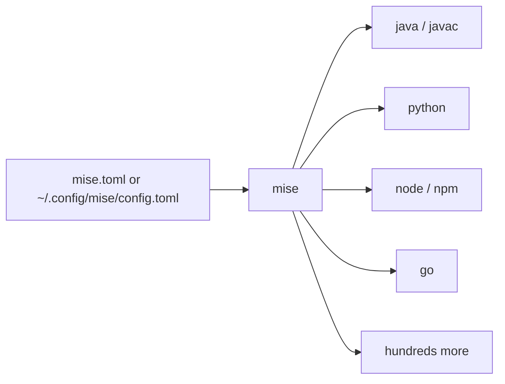

# 4. Languages and toolchains

[← Development workstation](03-dev-workstation.md) · [Home](../README.md) · [Used laptops →](05-used-laptops.md)

Section 3 got you a desktop, `apt`, SSH, and an editor. This chapter is the part where the machine starts compiling homework.

You do **not** need every language on day one. Install what this semester actually uses. The trap is mixing three version managers, a random PPA, and `sudo pip` until `python` is a haunted house.

**Default recommendation:** use **[mise](https://mise.jdx.dev/)** as the one tool that can install **Java, Python, Node.js, Go**, and friends. Add language-specific tools where they are genuinely better: **[uv](https://docs.astral.sh/uv/)** for Python projects, **[Cargo](https://doc.rust-lang.org/cargo/)** (via rustup) for Rust. Keep **GCC** and **Clang** as distro packages. Then glue it together in VS Code with the official extensions.

This chapter stops at a working toolchain. Once `python`, `go`, `node`, or `cargo` actually runs, the same GitHub org has project-shaped follow-ons (virtualenvs, modules, lint, tests). Those links sit in the Python, Go, Node, and Rust sections below — not next to Java or C, which do not have a matching tutorial.

If a professor says "use the Java on the lab machines," use that version. mise exists so you can *match* it at home, not so you can invent a fourth JDK.

## Distro packages vs a version manager

```text
apt/dnf  →  one version, shared with the OS, slow to change
mise     →  many versions, per user or per project, fast to switch
uv/cargo →  that language's own project workflow (deps, lockfiles, builds)
```

| Install with | Examples | Why |
| --- | --- | --- |
| **apt / dnf** | `gcc`, `clang`, `make`, `pkg-config`, git | Compilers and C libraries belong to the OS |
| **mise** | Java, Python, Node, Go | You will need 3.11 *and* 3.13, or Java 17 *and* 21 |
| **Language tool** | `uv`, `cargo`, `npm` | Project deps, virtualenvs, `Cargo.lock` |

The `python3` Mint shipped is for **system scripts**. Do not `pip install` into it. That is how you get Stack Overflow answers that start with "I broke apt."

Official mise docs: [Getting started](https://mise.jdx.dev/getting-started.html) · [Dev tools](https://mise.jdx.dev/dev-tools/) · [Registry](https://mise.jdx.dev/registry.html)

## mise: one CLI, many languages

[mise-en-place](https://mise.jdx.dev/) (usually just **mise**) installs runtimes, pins versions in a `mise.toml`, and switches them when you `cd` into a project. Think of it as a polyglot version manager that learned from nvm/asdf and then got a better config file.



### Install and activate

Confirm at [Installing mise](https://mise.jdx.dev/installing-mise.html):

```bash
curl https://mise.run | sh
~/.local/bin/mise --version
```

Activate it in Bash (Mint's default). Restart the terminal afterwards.

```bash
echo 'eval "$(~/.local/bin/mise activate bash)"' >> ~/.bashrc
source ~/.bashrc
mise doctor
```

Zsh: `eval "$(~/.local/bin/mise activate zsh)"` in `~/.zshrc`. Full matrix: [activate mise](https://mise.jdx.dev/getting-started.html#activate-mise).

Until activate is done, prefix commands with `~/.local/bin/mise`.

### Everyday commands

| Command | What it does |
| --- | --- |
| `mise use --global node@lts` | Install + set the **user** default |
| `mise use python@3.12` | Install + pin **this directory** (`mise.toml`) |
| `mise install` | Install whatever the current config asks for |
| `mise ls` / `mise ls --current` | What is installed / what is active |
| `mise ls-remote java` | Versions you can ask for |
| `mise exec python@3.12 -- python -V` | One-off, no PATH change |

`mise use` writes config **and** installs. `mise install` only downloads versions already listed. Details: [`mise use`](https://mise.jdx.dev/cli/use.html).

### Four languages, same muscle memory

After activate, these are enough for a CS workstation. Versions below are examples — pin what your course uses.

```bash
# Java — Temurin 21 is a solid LTS. Shorthand @21 is OpenJDK.
# https://mise.jdx.dev/lang/java.html
mise use --global java@temurin-21
java -version
javac -version
echo "$JAVA_HOME"          # mise sets this

# Python — the interpreter only. Projects still want uv (below).
# https://mise.jdx.dev/lang/python.html
mise use --global python@3.12
python --version

# Node.js — npm and npx come along
# https://mise.jdx.dev/lang/node.html
mise use --global node@lts
node -v
npm -v

# Go
# https://mise.jdx.dev/lang/go.html
mise use --global go@1.24
go version
```

Node is the runtime. A TypeScript or JavaScript project (pnpm, ESLint, tests, Vite) is [amitsk/typescript-development-env](https://github.com/amitsk/typescript-development-env).

Go after `go version` works — modules, tests, lint, and a sample service: [amitsk/go-development-env](https://github.com/amitsk/go-development-env). It uses mise the same way this chapter does.

Per-project pin (do this inside the homework repo):

```bash
cd ~/projects/cs101
mise use java@21 python@3.12 node@lts go@1.24
```

That writes a `mise.toml` you can commit so lab partners get the same versions:

```toml
[tools]
java = "temurin-21"
python = "3.12"
node = "lts"
go = "1.24"
```

Then `mise install` on any other machine. Trust prompt: `mise trust` — config files can run env hooks, so mise asks once. [Trust docs](https://mise.jdx.dev/cli/trust.html).

Do **not** stack mise with nvm and pyenv in the same shell unless you enjoy debugging `PATH` at 1 a.m. Pick one manager for runtimes.

## Python projects: uv

[uv](https://docs.astral.sh/uv/) is a fast Python package and project manager (from Astral, the Ruff people). It creates virtualenvs, resolves deps, and can even **install Python itself**. mise still wins if you also need Java and Go on the same laptop. uv wins the moment the assignment is "make a Python project."

Install (confirm: [uv installation](https://docs.astral.sh/uv/getting-started/installation/)):

```bash
curl -LsSf https://astral.sh/uv/install.sh | sh
uv --version
```

You can also `mise use --global uv` if you want mise to own the `uv` binary.

```bash
mkdir ~/projects/hello-uv && cd ~/projects/hello-uv
uv init
uv add requests
uv run python -c "import requests; print(requests.__version__)"
```

Useful extras:

```bash
uv python install 3.12     # uv can fetch interpreters too
uv venv                    # .venv in the project
uv pip install flask       # pip-compatible interface
uv lock                    # lockfile for the team
```

First steps: [uv first steps](https://docs.astral.sh/uv/getting-started/first-steps/). Do not mix `sudo pip`, `conda`, and `uv` in the same project. One story per repo.

When the assignment is a real Python project (venv, Ruff, pytest, types, maybe FastAPI): [amitsk/python-development-env](https://github.com/amitsk/python-development-env). That tutorial assumes you can run Python; this chapter is how you got there.

## Rust: rustup and Cargo

Rust's toolchain is its own planet, and that planet is **[rustup](https://rustup.rs/)** plus **[Cargo](https://doc.rust-lang.org/cargo/)**. Cargo is the `npm`/`uv` of Rust: new project, deps, build, test, `Cargo.lock`.

```bash
curl --proto '=https' --tlsv1.2 -sSf https://sh.rustup.rs | sh
source "$HOME/.cargo/env"
rustc --version
cargo --version
```

```bash
cargo new hello-rs
cd hello-rs
cargo run
```

Book and refs: [The Cargo Book](https://doc.rust-lang.org/cargo/) · [rustup book](https://rust-lang.github.io/rustup/). mise can install Rust too (`mise use rust`); rustup is still the usual path for `rustup component add rust-analyzer` and nightly/stable switching.

C compilers below still matter: some crates talk to C libraries via `pkg-config` and `build-essential`.

Clippy, rustfmt, tests, sqlx, and Axum are the next layer, not this chapter: [amitsk/rust-development-env](https://github.com/amitsk/rust-development-env).

## Node.js without mise: Volta and nvm

If you already use mise for Node, skip this. If a tutorial, club, or teammate lives in a Node-only world, these two names will appear.

| Tool | Style | Start here |
| --- | --- | --- |
| **[Volta](https://volta.sh/)** | Pins `node`/`yarn`/`pnpm` in `package.json` | [Getting started](https://docs.volta.sh/guide/getting-started) |
| **[nvm](https://github.com/nvm-sh/nvm)** | Classic shell functions, `.nvmrc` | README on that repo |

```bash
# Volta
curl https://get.volta.sh | bash
volta install node

# nvm — copy the current install command from the nvm README
# https://github.com/nvm-sh/nvm#install--update-script
```

mise can read `.nvmrc` if you enable idiomatic version files. See [mise configuration](https://mise.jdx.dev/configuration.html). Running **mise and nvm together** is how `node` silently becomes the wrong version. Choose one.

If you landed here because a teammate uses nvm or Volta, [amitsk/typescript-development-env](https://github.com/amitsk/typescript-development-env) chapter 2 compares those with mise. Read it before you install a second Node manager "just in case." The rest of that tutorial is the project layer (packages, lint, tests), not a third way to install Node.

## C and C++: GNU and LLVM

Language version managers do not replace **system compilers**. C and C++ toolchains come from the distro, and two families show up in CS courses:

| Family | Compiler driver | What you type |
| --- | --- | --- |
| **GNU** ([GCC](https://gcc.gnu.org/)) | `gcc`, `g++` | The default on Mint/Ubuntu; most Makefiles assume it |
| **LLVM** ([Clang](https://clang.llvm.org/)) | `clang`, `clang++` | Friendlier diagnostics; same flags more often than not |

Install **both**. They coexist. Your course will say which one grades the assignment.

### Mint / Ubuntu (GNU)

`build-essential` is GCC, `g++`, `make`, and libc headers — already in [section 3.4](03-dev-workstation.md#34-basic-tools-and-utilities). Add a debugger if you skipped it:

```bash
sudo apt install build-essential gdb pkg-config
gcc --version
g++ --version
make --version
```

Tiny sanity check (more Make in [learning-shell: build systems](https://github.com/amitsk/learning-shell/blob/main/scripts/build_systems.md)):

```bash
printf '%s\n' '#include <stdio.h>' 'int main(void) { puts("hi"); }' > hi.c
gcc -Wall -Wextra -o hi hi.c && ./hi
```

### LLVM / Clang

```bash
sudo apt install clang clang-format clang-tidy lldb lld
clang --version
clang++ --version
```

```bash
clang -Wall -Wextra -o hi hi.c && ./hi
```

`clang-format` is the "stop arguing about braces" tool. `lld` is LLVM's linker. You do not need to compile LLVM from source.

**Fedora:**

```bash
sudo dnf group install development-tools
sudo dnf install gcc gcc-c++ gdb pkgconf-pkg-config clang clang-tools-extra lldb lld
```

Which one for class? If the autograder is silent, **GCC** is the conservative bet on Mint. If the assignment mentions sanitizers (`-fsanitize=address`) or "use clang-tidy," install LLVM and actually use it. Both understand `-Wall`. Neither will save a missing `#include`.

## VS Code extensions

Most languages have a first-party or officially blessed **VS Code** extension. Install VS Code first ([section 3.9](03-dev-workstation.md#39-developer-tools-editors-and-coding-agents)), then add extensions for the languages you actually opened this week — not the whole marketplace.

| Language | Extension (search this name) | Marketplace |
| --- | --- | --- |
| Python | Python (Microsoft) | [ms-python.python](https://marketplace.visualstudio.com/items?itemName=ms-python.python) |
| Java | Extension Pack for Java | [vscjava.vscode-java-pack](https://marketplace.visualstudio.com/items?itemName=vscjava.vscode-java-pack) |
| Node / JS / TS | ESLint, Prettier (JS/TS are built in) | [ESLint](https://marketplace.visualstudio.com/items?itemName=dbaeumer.vscode-eslint) · [Prettier](https://marketplace.visualstudio.com/items?itemName=esbenp.prettier-vscode) |
| Go | Go | [golang.go](https://marketplace.visualstudio.com/items?itemName=golang.go) |
| Rust | rust-analyzer | [rust-lang.rust-analyzer](https://marketplace.visualstudio.com/items?itemName=rust-lang.rust-analyzer) |
| C / C++ | C/C++ (Microsoft) | [ms-vscode.cpptools](https://marketplace.visualstudio.com/items?itemName=ms-vscode.cpptools) |

CLI install example:

```bash
code --install-extension ms-python.python
code --install-extension vscjava.vscode-java-pack
code --install-extension golang.go
code --install-extension rust-lang.rust-analyzer
code --install-extension ms-vscode.cpptools
```

VS Code must see the **same** `java`, `python`, `go`, and `node` as your terminal. If mise is activated in the shell, launch `code` from that terminal (`code .`) so `PATH` and `JAVA_HOME` match. If the Java extension cannot find a JDK, it will sulk; `echo $JAVA_HOME` in that terminal is the first check.

**IntelliJ IDEA** already speaks Java (and Kotlin). For Python/Go/JS, JetBrains has sibling IDEs (PyCharm, GoLand, WebStorm) or plugins in IDEA Ultimate. Community Edition + VS Code is a normal student split.

## A sane default stack

```bash
# compilers (OS)
sudo apt install build-essential gdb pkg-config clang clang-format

# runtimes (mise)
mise use --global java@temurin-21 python@3.12 node@lts go@1.24

# Python projects
curl -LsSf https://astral.sh/uv/install.sh | sh

# Rust, if this semester needs it
# curl --proto '=https' --tlsv1.2 -sSf https://sh.rustup.rs | sh
```

Then open VS Code and install only the extensions for those languages.

If a language above is this semester's job, continue in the matching environment tutorial instead of collecting more installers:

| You just installed | Next tutorial |
| --- | --- |
| Python + uv | [amitsk/python-development-env](https://github.com/amitsk/python-development-env) |
| Go (mise) | [amitsk/go-development-env](https://github.com/amitsk/go-development-env) |
| Node (mise, Volta, or nvm) | [amitsk/typescript-development-env](https://github.com/amitsk/typescript-development-env) |
| Rust (rustup / Cargo) | [amitsk/rust-development-env](https://github.com/amitsk/rust-development-env) |

## What not to do

- Do not `sudo pip install` or `sudo npm install -g` everything into the OS.
- Do not run mise **and** nvm **and** Volta for Node at the same time.
- Do not compile GCC from source because a blog from 2014 said so.
- Do not install every JDK vendor "just in case." One LTS (17 or 21) plus whatever the course pins.

---

**Next:** [Used laptops and bringing old machines back →](05-used-laptops.md)
