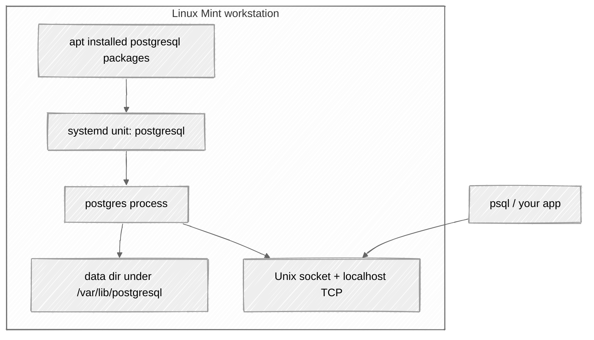

# 5a. Setting up a development workstation

[← Running Linux: VMs and containers](04-running-linux.md) · [Home](../README.md) · [Omarchy workstation →](05b-omarchy.md)

This is the "make the computer useful" chapter. The reference desktop is **Linux Mint Cinnamon edition**. Commands are Debian/Ubuntu-shaped, so they also work on Ubuntu with small naming differences. Fedora notes sit at the end of each major step.

If you would rather run a keyboard-first Arch desktop, that path is [chapter 5b: Omarchy](05b-omarchy.md). This chapter is the start-menu-and-mouse path. Most of the *ideas* transfer; the keybindings do not.

You will:

1. Install Mint from official docs
2. Update the system and learn `apt`
3. Install basic tools, Git/gh, coding fonts, modern prompts, and (optionally) modern CLI utilities
4. Enable an SSH server
5. Turn on UFW
6. Add users and groups
7. Stand up PostgreSQL from scratch
8. Install (or at least bookmark) a real editor and AI coding CLIs
9. Pick database and REST clients, plus `jq` / `yq`
10. Then install compilers and languages in [section 6](06-languages.md)

You can follow this chapter on hardware or inside the [VM from chapter 4](04-running-linux.md). If Mint is already installed in your VM, start at first boot below. Containers do not provide the full desktop and service environment assumed here.

Take snapshots with Timeshift before you get adventurous. Future-you is a harsh code reviewer.

## 5.1 Install Linux Mint Cinnamon

Use the official documents. They are maintained; this paragraph is not a substitute for them.

| Step | Official link |
| --- | --- |
| Pick **Cinnamon edition** | [Download Linux Mint](https://linuxmint.com/download.php) |
| Verify ISO, write USB, live-boot, install | [Linux Mint Installation Guide](https://linuxmint-installation-guide.readthedocs.io/en/latest/) |
| Installer screens | [Install Linux Mint](https://linuxmint-installation-guide.readthedocs.io/en/latest/install.html) |
| After install | [Hardware drivers](https://linuxmint-installation-guide.readthedocs.io/en/latest/drivers.html) · [Timeshift snapshots](https://linuxmint-installation-guide.readthedocs.io/en/latest/timeshift.html) |
| User guide / release notes | [Linux Mint documentation](https://linuxmint.com/documentation.php) |

Practical notes that the installer will not put on a motivational poster:

- **Cinnamon** is the edition with the traditional menu and panel. That is the one this tutorial assumes.
- Connect ethernet or Wi-Fi in the live session so you can tick **multimedia codecs** during install.
- If this machine will *only* run Linux and the disk is empty, "Erase disk and install Linux Mint" is the honest option. Dual boot needs a backup first, not bravery.
- After reboot, open **Driver Manager** if Wi-Fi or graphics look cursed. NVIDIA laptops in particular.

### Same job, other distros

The rest of this chapter is written against Mint Cinnamon, but the job is "a Debian-family desktop with a start menu and a mouse." Two Ubuntu flavors are excellent *light* alternatives if Mint feels heavy, the laptop is tired, or you simply like their look:

- **[Xubuntu](https://xubuntu.org/)** — Ubuntu with [XFCE](https://www.xfce.org/). Traditional panel, application menu, click-to-launch. Kind to old laptops; see [chapter 7](07-used-laptops.md).
- **[Ubuntu Budgie](https://ubuntubudgie.org/)** — Ubuntu with [Budgie](https://buddiesofbudgie.org/). Same menu-and-mouse grammar as Mint, a bit more polish, still lighter than GNOME.

Both keep the navigation paradigm this chapter assumes: a menu, windows you drag, settings you click. You will not need a tiling-window-manager cheat sheet. And because they are Ubuntu under the hood, **most of the material in this chapter works with minimal modifications** — `apt`, OpenSSH, UFW, `adduser`, PostgreSQL packages, VS Code's `.deb` repo. The menu labels differ; the commands do not. Install from their docs, then start at [first boot](#52-first-boot-become-a-boring-up-to-date-machine).

Other options, if a course or curiosity demands them:

- Ubuntu GNOME: [Install Ubuntu desktop](https://ubuntu.com/tutorials/install-ubuntu-desktop) · all [Ubuntu flavors](https://ubuntu.com/desktop/flavours)
- Fedora Workstation (GNOME): [Download](https://fedoraproject.org/workstation/download) · [Getting started / install](https://docs.fedoraproject.org/en-US/fedora/latest/getting-started/)
- Fedora other desktops: [Fedora Spins](https://fedoraproject.org/spins/)
- Keyboard-first Arch desktop: [chapter 5b, Omarchy](05b-omarchy.md)

## 5.2 First boot: become a boring, up-to-date machine

1. Log into Cinnamon.
2. Run **Update Manager** (shield icon) and install everything. Reboot if a kernel landed.
3. Open a terminal (`Ctrl+Alt+T` or Menu → Terminal).
4. Confirm you can use sudo:

```bash
whoami
sudo -v
```

Then follow [Getting started with the Unix shell](https://github.com/amitsk/learning-shell/blob/main/scripts/getting_started.md) until you can create a file with `nano` without googling "how to save."

Mint ships **Timeshift**. After the first successful update, create a snapshot. It is the closest thing Linux has to a save point before a boss fight.

## 5.3 apt: the grocery store

On Mint (and Ubuntu), software is installed with **APT**. `apt` is the friendly frontend; `dpkg` is the low-level unpacker. You almost always want `apt`.

Official references:

- [Ubuntu: Install and manage packages](https://ubuntu.com/server/docs/how-to/software/package-management/)
- `man apt` and `man apt-get` on your machine (always current)

### The loop you will type for the rest of your life

```bash
sudo apt update              # refresh the catalog (does not install upgrades)
apt list --upgradable        # see what would change
sudo apt upgrade             # install available upgrades
sudo apt full-upgrade        # allowed to add/remove packages to finish the upgrade
sudo apt autoremove          # leftover dependencies you no longer need
```

`update` is "download the menu." `upgrade` is "eat the food." Skipping `update` is how you get "package not found" for a package that definitely exists.

### Installing and removing software

```bash
apt search postgresql        # search the catalog
apt show git                 # metadata, version, description
sudo apt install git curl wget build-essential
sudo apt remove some-package      # remove the program, keep config
sudo apt purge some-package       # remove program and its config
```

`build-essential` is compilers and Make — the minimum kit for CS homework that says "just compile it." Make itself is covered in [learning-shell: build systems](https://github.com/amitsk/learning-shell/blob/main/scripts/build_systems.md).

### Where APT looks

- Main lists: `/etc/apt/sources.list` and `/etc/apt/sources.list.d/`
- Mint also uses its own repositories on top of Ubuntu's. Do not mix random PPAs like trading cards.
- Prefer **Update Manager** or `apt` over downloading `.deb` files by hand. A lone `.deb` does not get updates unless it came from a repo.

### apt vs apt-get vs the GUI

| Tool | Use it for |
| --- | --- |
| `apt` | Interactive terminal (this tutorial) |
| `apt-get` / `apt-cache` | Scripts; older docs |
| Update Manager | Clicky upgrades, kernel updates, mintupdate policy |
| Software Manager | Browse apps; often Flatpak |

Mint prefers **Flatpak** for desktop apps that move fast (browsers, IDEs sometimes). APT stays king for system packages: `openssh-server`, `ufw`, `postgresql`, compilers.

**Fedora:** `sudo dnf upgrade --refresh` and `sudo dnf install git`. Docs: [Using DNF](https://docs.fedoraproject.org/en-US/quick-docs/dnf/).

## 5.4 Basic tools and utilities

After the first upgrade:

```bash
sudo apt install \
  git curl wget htop tmux unzip zip \
  build-essential pkg-config \
  ca-certificates gnupg \
  openssh-client
```

Then:

```bash
git --version
git config --global user.name "Your Name"
git config --global user.email "you@example.com"
```

### Git, and the GitHub CLI

`git` is the version control system. It tracks commits on your machine. [GitHub CLI](https://cli.github.com/) (`gh`) is how you talk to GitHub from that same terminal: clone private repos, open pull requests, inspect Actions, comment on issues. Official manual: [GitHub CLI](https://cli.github.com/manual/).

Install `gh` from GitHub's Debian/Ubuntu instructions rather than from memory: [Installing gh on Linux](https://github.com/cli/cli/blob/trunk/docs/install_linux.md). Then:

```bash
gh auth login
gh --version
```

Why this is worth a slot on a student workstation, especially once coding agents show up in [section 5.9](#59-developer-tools-editors-and-coding-agents): LLM harnesses are much better at `gh` than at clicking around github.com. The CLI has stable flags, `--json` output, and non-interactive commands (`gh pr create`, `gh issue list`, `gh run view`). Agents already know this tool; GitHub even ships [an agent skill for it](https://github.com/cli/cli#agent-skills). A GUI git client is fine for *you*. `gh` is what you install so the agent can file the PR without inventing a browser automation hobby.

`git` still does the actual commits. `gh` is GitHub's front door.

### Terminals

The Cinnamon default (Menu → Terminal, or `Ctrl+Alt+T`) is GNOME Terminal. It works, and it is what this tutorial means when it says "open a terminal."

If you want a faster or more modern emulator, the usual alternatives are [Ghostty](https://ghostty.org/), [Kitty](https://sw.kovidgoyal.net/kitty/), [Alacritty](https://alacritty.org/), and [WezTerm](https://wezfurlong.org/wezterm/). This author uses and recommends **Ghostty** when the machine can support it — it is GPU-accelerated and wants a reasonably recent OpenGL stack. If Ghostty will not launch, keep the default, especially on older laptops ([section 7](07-used-laptops.md)).

### Coding fonts: Nerd Fonts (banishing the tofu)

Your default terminal font renders letters and numbers just fine. But the moment a modern prompt or editor tries to display a Git branch icon (``), a Python snake, a folder glyph, or a Docker whale, standard fonts surrender and show a hollow rectangle (`□`) or a question mark inside a diamond (``). In terminal typography, this is affectionately known as **tofu**—and staring at a terminal full of tofu makes reading your status line feel like deciphering alien hieroglyphs.

Enter **[Nerd Fonts](https://www.nerdfonts.com/)**. The Nerd Fonts project takes beloved open-source monospaced fonts and patches them with thousands of developer glyphs and symbols from Font Awesome, Devicons, Octicons, and Powerline.

#### Recommended fonts

Pick one. Installing fifteen fonts does not make your code compile faster.

| Font | Vibe | Download link |
| --- | --- | --- |
| **JetBrains Mono Nerd Font** | Modern, clean, generous x-height, engineered for readability | [JetBrainsMono.tar.xz](https://github.com/ryanoasis/nerd-fonts/releases/latest/download/JetBrainsMono.tar.xz) |
| **Fira Code Nerd Font** | The classic developer darling with programming ligatures (`!=`, `->`) | [FiraCode.tar.xz](https://github.com/ryanoasis/nerd-fonts/releases/latest/download/FiraCode.tar.xz) |
| **Meslo LGS NF** | The battle-tested default recommended by many prompt themes | [Meslo.tar.xz](https://github.com/ryanoasis/nerd-fonts/releases/latest/download/Meslo.tar.xz) |
| **Hack Nerd Font** | Geometric, crisp, workhorse monospace with no surprises | [Hack.tar.xz](https://github.com/ryanoasis/nerd-fonts/releases/latest/download/Hack.tar.xz) |

#### How to install (any Linux distro)

You don't need root, a PPA, or a package manager to install fonts on Linux. Fontconfig automatically looks in `~/.local/share/fonts` for user-installed fonts:

```bash
# 1. Create your user fonts directory
mkdir -p ~/.local/share/fonts

# 2. Download and extract your chosen font (e.g. JetBrains Mono)
cd ~/.local/share/fonts
curl -fLO https://github.com/ryanoasis/nerd-fonts/releases/latest/download/JetBrainsMono.tar.xz
tar -xf JetBrainsMono.tar.xz
rm JetBrainsMono.tar.xz

# 3. Refresh the font cache so the system discovers it
fc-cache -fv
```

Verify that the system registered your new font:

```bash
fc-list : family | grep -i "JetBrainsMono Nerd Font" | head -n 3
```

#### Actually tell your terminal to use it

Downloading a font does not automatically configure your terminal. Linux respects your autonomy, even when you make questionable aesthetic choices.

- **GNOME Terminal (Mint default):**
  1. Open the terminal, go to **Edit** → **Preferences** (or right-click anywhere in the terminal → **Preferences**).
  2. Under **Profiles** in the sidebar, click your active profile (usually "Unnamed").
  3. In the **Text** tab, check the box for **Custom font**.
  4. Click the font selector button, search for `JetBrainsMono Nerd Font` (or `FiraCode Nerd Font Mono`), set the size to 11 or 12, and click **Select**.
- **Ghostty:**
  Add this to `~/.config/ghostty/config`:
  ```ini
  font-family = "JetBrainsMono Nerd Font"
  ```
- **Kitty / Alacritty:** Set `font_family JetBrainsMono Nerd Font` in `~/.config/kitty/kitty.conf` or `font.normal.family: "JetBrainsMono Nerd Font"` in `~/.config/alacritty/alacritty.toml`.

Restart the terminal or open a fresh tab. Congratulations, you are officially immune to the tofu epidemic.

### Prompt customization: Starship and Oh My Posh

The default Bash prompt looks like this:

```text
user@workstation:~/projects/homework$ 
```

It is functional. It is also the terminal equivalent of plain unbuttered toast. It tells you who you are (which you hopefully remember), where you are, and nothing else. It will not tell you:

- What Git branch you are on,
- Whether you have 17 unstaged files about to be wiped out by an accidental `git checkout`,
- What Python virtualenv, Node version, or Rust toolchain is currently active,
- Or that the last command you ran silently exited with code 137 because the kernel OOM killer murdered it.

Modern prompt engines turn your prompt into an informative heads-up display. The two heavyweight contenders are **Starship** and **Oh My Posh**.

> [!WARNING]
> **Pick ONE prompt engine.** Adding both `eval "$(starship init bash)"` and `eval "$(oh-my-posh init bash ...)"` to your `~/.bashrc` will cause them to duel for standard output on every single keystroke. It looks like a glitch art festival and will drive you mad.

#### Option A: Starship (fast, clean, Rust-powered)

[Starship](https://starship.rs/) is minimal, blazing fast, and cross-shell (Bash, Zsh, Fish). Its design philosophy is simple: show information only when it is actually relevant. In a Git repo? It shows branch and dirty status. In a Python project? It shows the Python version. On an empty directory? It stays completely out of your way.

**1. Install Starship:**

```bash
curl -sS https://starship.rs/install.sh | sh
```

*(The official script will ask for sudo only if installing to `/usr/local/bin`; otherwise you can install to `~/.local/bin` without root.)*

**2. Activate in Bash:**

Add the initialization hook to the end of your `~/.bashrc`:

```bash
echo 'eval "$(starship init bash)"' >> ~/.bashrc
source ~/.bashrc
```

Instant gratification: your prompt now shows directory context, Git status, language runtimes, and execution duration.

**3. Customize Starship (optional):**

Starship configuration lives in `~/.config/starship.toml`. If you installed a Nerd Font earlier, enable Starship's rich symbols preset:

```bash
starship preset nerd-font-symbols -o ~/.config/starship.toml
```

Or write your own minimal tweaks (`~/.config/starship.toml`):

```toml
# Don't print a blank line before every prompt
add_newline = false

# Show execution time for commands that take longer than 2 seconds
[cmd_duration]
min_time = 2_000
format = "took [$duration]($style) "

# Custom prompt character
[character]
success_symbol = "[➜](bold green)"
error_symbol = "[✗](bold red)"
```

See the [Starship configuration guide](https://starship.rs/guide/) and [presets](https://starship.rs/presets/) for deeper tweaking.

**Fedora:** `sudo dnf copr enable atim/starship && sudo dnf install starship` or use the official curl script.

#### Option B: Oh My Posh (vibrant, thematic, Powerline aesthetic)

[Oh My Posh](https://ohmyposh.dev/) originated in the PowerShell world but has evolved into a full-blown, Go-powered cross-shell prompt engine. If you want colorful "powerline" pill segments, distinct color-coded blocks, and an endless closet of designer themes, Oh My Posh is your vehicle.

**1. Install Oh My Posh:**

```bash
curl -s https://ohmyposh.dev/install.sh | bash -s
```

The script drops the binary into `~/.local/bin` and clones 80+ official themes into `~/.cache/oh-my-posh/themes`. Make sure `~/.local/bin` is in your `PATH` (on Mint/Ubuntu, standard `.bashrc` includes it if the directory exists; run `export PATH=$PATH:$HOME/.local/bin` if it's missing in your current session).

**2. Activate in Bash with a theme:**

Add the init command to `~/.bashrc`, pointing to your theme of choice:

```bash
echo 'eval "$(oh-my-posh init bash --config ~/.cache/oh-my-posh/themes/jandedobbeleer.omp.json)"' >> ~/.bashrc
source ~/.bashrc
```

**3. Browse and preview themes:**

Oh My Posh includes a built-in gallery viewer. Run this in your terminal:

```bash
oh-my-posh get themes
```

To switch themes, change the config path in `~/.bashrc` to any other theme in `~/.cache/oh-my-posh/themes/` (popular picks include `bubbles.omp.json`, `catppuccin.omp.json`, `half-life.omp.json`, and `atomic.omp.json`), then reload your shell.

#### Starship vs. Oh My Posh: Which should you choose?

| Feature | Starship | Oh My Posh |
| --- | --- | --- |
| **Engine** | Rust (single compiled binary) | Go (single compiled binary) |
| **Aesthetic** | Discreet, minimalist badges; context appears only when needed | Expressive, full-color Powerline pill segments and banners |
| **Configuration** | Single `~/.config/starship.toml` file | JSON, YAML, or TOML theme configs |
| **Theme library** | Modular presets via CLI (`starship preset ...`) | 80+ bundled out-of-the-box community themes |
| **Best for** | Anyone who wants clean speed and zero distraction | Anyone who wants their terminal to look like a sci-fi flight deck |

Both tools work across Bash, Zsh, and Fish, and both look broken without a Nerd Font. Try Starship first if you want something fast that gets out of your way; reach for Oh My Posh if you enjoy colorful segment styling.

### Other terminal polish

- [Helix](https://helix-editor.com/) or [Neovim](https://neovim.io/) if you want a terminal editor with opinions
- A browser that is not a group project (Firefox is already there)

Editors (GUI and CLI) are compared in [learning-shell: text editors](https://github.com/amitsk/learning-shell/blob/main/scripts/text_editors.md).

### Modern replacements for Unix utilities

The tools in [section 5.4](#54-basic-tools-and-utilities) (`curl`, `git`, `htop`) are the ones that still exist on every server. On this workstation you can also install interactive upgrades: nicer defaults at the prompt, same jobs.

**Use the classics in scripts, Makefiles, Dockerfiles, and agent instructions.** Use the tools below when your eyeballs are looking at the glass. Aliasing `cat` to `bat` in a pipeline is how a CI job hangs waiting for `q`.

```bash
sudo apt install \
  bat ripgrep fd-find fzf \
  eza zoxide git-delta \
  btop duf tealdeer
```

Debian/Ubuntu name collisions: the `bat` binary is `batcat`, and `fd-find` installs `fdfind`. Symlinks, `PATH`, and aliases live in the learning-shell chapter linked below. `dust` is not in Ubuntu 24.04 / Mint 22; skip it or install from GitHub releases.

Interactive upgrades (the POSIX tool remains the one you need on a server):

- **`bat`** for viewing files: syntax highlighting, line numbers, git gutters, automatic pager.
- **`eza`** for listings: color-coded file types, git status in the listing, built-in tree view.
- **`ripgrep` (`rg`)** for content search: respects `.gitignore`, skips binaries.
- **`fd`** for filename search: `fd pattern` instead of `find -name`.
- **`zoxide` (`z`)** for directories you have already visited (`z proj`).
- **`delta`** for git diffs: side-by-side, word-level highlighting.
- **`duf`** for disk-free tables. (`dust` for "what ate the disk," when the package exists.)

Aliases, the Debian `batcat`/`fdfind` trap, and when to keep POSIX are in
**[learning-shell: Modern Replacements for Unix Utilities](https://github.com/amitsk/learning-shell/blob/main/scripts/modern_tools.md)**.

**Fedora:** `sudo dnf install bat ripgrep fd-find fzf eza zoxide git-delta btop duf tealdeer dust`

## 5.5 SSH server: so the machine can be a machine

You already have an **SSH client** (`ssh`). An **SSH server** (`sshd`) lets you log *into* this workstation from another computer — laptop in the other room, phone, future-you on a VM.

Ubuntu's guide is the canonical walkthrough (Mint is Ubuntu-family):

- [Ubuntu: OpenSSH server](https://ubuntu.com/server/docs/how-to/security/openssh-server/)
- Client-side keys: [learning-shell: Using SSH](https://github.com/amitsk/learning-shell/blob/main/scripts/getting_started.md#6-using-ssh-to-connect-to-a-remote-server)

### Install and enable

```bash
sudo apt install openssh-server
sudo systemctl enable --now ssh
systemctl status ssh
```

On Ubuntu the unit is often `ssh`; if status says missing, try `sshd`. `systemctl status` is the source of truth.

### First login from another box

```bash
ip -brief addr          # find this machine's LAN IP, e.g. 192.168.1.42
```

From the other computer:

```bash
ssh youruser@192.168.1.42
```

Then set up **key-based auth** using the learning-shell steps (`ssh-keygen`, `ssh-copy-id`). Do not disable passwords until a key login has worked twice.

Keep SSH on the **LAN** unless you know what port forwarding, fail2ban, and "I enjoy being scanned" mean. If you do expose it, keys only, no root login.

**Fedora:** `sudo dnf install openssh-server && sudo systemctl enable --now sshd`

## 5.6 UFW: a firewall you will actually enable

[UFW](https://help.ubuntu.com/community/UFW) (Uncomplicated Firewall) is a frontend to kernel packet filtering. Default desktop Mint may ship it inactive. A workstation that runs `sshd` should not.

```bash
sudo apt install ufw
sudo ufw default deny incoming
sudo ufw default allow outgoing
sudo ufw allow OpenSSH          # or: sudo ufw allow 22/tcp
sudo ufw enable
sudo ufw status verbose
```

`allow OpenSSH` uses the application profile so you do not have to remember 22. If SSH is broken after this, you are either filtering the wrong port or you enabled UFW *before* allowing SSH — in which case you need physical/console access. Order matters. Allow, then enable.

Do **not** `ufw allow 5432` unless you *intend* other machines to talk to PostgreSQL. Local clients use a Unix socket and do not need that hole.

**Fedora:** firewalld instead of UFW. [Firewalld docs](https://docs.fedoraproject.org/en-US/quick-docs/firewalld/). Example: `sudo firewall-cmd --permanent --add-service=ssh && sudo firewall-cmd --reload`

## 5.7 Users and groups

You will add a second user. This is useful for:

- homework vs admin work
- practicing permissions
- running services without inflating your main account

Full conceptual guide (passwd/group files, `id`, `usermod`): [learning-shell: User and Group Management](https://github.com/amitsk/learning-shell/blob/main/scripts/users_groups.md)

On Debian/Mint, prefer `adduser` (interactive, creates a home directory) over raw `useradd`.

```bash
sudo adduser student          # follow the prompts
sudo groupadd cs101
sudo adduser student cs101    # Debian/Mint shortcut; on Fedora use: sudo usermod -aG cs101 student
id student
groups student
```

Give someone sudo (think twice):

```bash
sudo usermod -aG sudo student
```

The `-a` in `-aG` is "append." Forget it and you replace their entire supplementary group list with just that one group. That is a rite of passage. It is also annoying.

Switch user to test:

```bash
su - student
pwd
exit
```

## 5.8 PostgreSQL from scratch

Goal: a local PostgreSQL that you created, can log into, and can point an app at. Not a production HA cluster. This exercise installs PostgreSQL as a host service; the container approach in chapter 4 is a separate option.

Official package docs (Mint uses Ubuntu packages):

- [PostgreSQL: Linux downloads — Ubuntu](https://www.postgresql.org/download/linux/ubuntu/)
- [PostgreSQL: Debian](https://www.postgresql.org/download/linux/debian/)
- Optional newer versions: [PGDG apt wiki](https://wiki.postgresql.org/wiki/Apt)

### Install the distro packages

```bash
sudo apt update
sudo apt install postgresql postgresql-contrib
sudo systemctl enable --now postgresql
systemctl status postgresql
```

That starts a server and a default cluster, typically owned by the `postgres` OS user.

### Create a role and a database for *you*

```bash
sudo -u postgres psql
```

Inside `psql`:

```sql
CREATE USER devuser WITH PASSWORD 'change-me-now';
CREATE DATABASE homework OWNER devuser;
GRANT ALL PRIVILEGES ON DATABASE homework TO devuser;
\c homework
GRANT ALL ON SCHEMA public TO devuser;
\du
\l
\q
```

Pick a real password. "change-me-now" is a sample, not a lifestyle.

> **PostgreSQL 15+ Note:** Modern distros ship PostgreSQL 15 or 16. In these releases, default permissions on the `public` schema are tightened for security. Running `\c homework` and `GRANT ALL ON SCHEMA public TO devuser;` ensures your user can create tables without getting hit with a `permission denied for schema public` error.

### Connect as that user

Mint/Ubuntu default `pg_hba.conf` uses **peer** auth for local Unix sockets (your OS user must match the DB role) and **scram/md5** for TCP. Easiest first connection for a named role:

```bash
psql -h 127.0.0.1 -U devuser -d homework
```

`-h 127.0.0.1` forces TCP so the password you set actually gets asked.

*(Troubleshooting tip: If you typoed your password earlier or authentication fails, you can reset `devuser`'s password anytime from the postgres superuser: `sudo -u postgres psql -c "ALTER USER devuser WITH PASSWORD 'change-me-now';"`)*

Sanity check:

```sql
SELECT version();
CREATE TABLE notes (id serial PRIMARY KEY, body text);
INSERT INTO notes (body) VALUES ('hello from mint');
SELECT * FROM notes;
\q
```

### What you installed, in design terms



Config lives under `/etc/postgresql/<version>/main/` (`postgresql.conf`, `pg_hba.conf`). Logs are in `/var/log/postgresql/`. Restart after config edits:

```bash
sudo systemctl restart postgresql
```

Do not bind PostgreSQL to `0.0.0.0` and do not UFW-open 5432 for fun. Localhost is enough for coursework.

**Fedora:** `sudo dnf install postgresql-server postgresql-contrib` then `sudo postgresql-setup --initdb` and `sudo systemctl enable --now postgresql`. Fedora does **not** always init the cluster on package install — that extra `postgresql-setup` step is the "from scratch" part. See [PostgreSQL on Fedora](https://docs.fedoraproject.org/en-US/quick-docs/postgresql/).

## 5.9 Developer tools: editors and coding agents

Install what you will actually open this semester. Bookmarks count; unused IDEs do not.

### Visual Studio Code

- Linux install: [Visual Studio Code on Linux](https://code.visualstudio.com/docs/setup/linux)
- On Mint/Ubuntu, the Debian `.deb` repo from that page keeps VS Code updated via `apt`.

```bash
# After following Microsoft's repo setup on the page above:
sudo apt install code
```

Language extensions (Python, Java, Go, Rust, C/C++) are listed in [section 6](06-languages.md#vs-code-extensions). Install VS Code here; add plugins after you have a compiler.

### IntelliJ IDEA

- [Install IntelliJ IDEA](https://www.jetbrains.com/help/idea/installation-guide.html)
- [JetBrains Toolbox](https://www.jetbrains.com/toolbox-app/) is the least painful way to install, update, and run IDEA / PyCharm / WebStorm side by side
- Snap (Ubuntu-ish): `sudo snap install intellij-idea-community --classic` — only if you already use snaps. Mint users often prefer Toolbox or a tarball from JetBrains.

Community Edition is enough for Java coursework. Ultimate is a paid product; use what your school licenses.

### AI coding CLIs

These are optional. They are also what a lot of students will be asked about in hackathons and internships. Official installers change; prefer the docs over copying a `curl | bash` from memory.

> **Syllabus sanity check:** Before pointing an autonomous coding agent at your data structures assignment, check your course's AI policy. Getting an academic misconduct hearing because an agent hallucinated a non-standard Fibonacci heap is an expensive way to learn about prompts. Use them to learn, debug, and build personal projects—not to bypass understanding.

| Tool | What it is | Start here |
| --- | --- | --- |
| **Codex** | OpenAI's coding agent / CLI | [Codex product](https://openai.com/codex/) · [Codex CLI docs](https://developers.openai.com/codex/cli/) · [GitHub: openai/codex](https://github.com/openai/codex) |
| **Grok Build** | xAI / SpaceXAI terminal coding agent | [x.ai/build](https://x.ai/build) · [Grok Build docs](https://docs.x.ai/build/overview) · [GitHub: xai-org/grok-build](https://github.com/xai-org/grok-build) |
| **Claude Code** | Anthropic's coding agent | [Claude Code](https://claude.com/product/claude-code) · [Overview](https://code.claude.com/docs/en/overview) · [Quickstart](https://code.claude.com/docs/en/quickstart) |

Typical Linux install commands (verify on the official page before you pipe anything to a shell):

```bash
# Codex CLI — confirm at https://developers.openai.com/codex/cli/
curl -fsSL https://chatgpt.com/codex/install.sh | sh

# Grok Build — confirm at https://docs.x.ai/build/overview
curl -fsSL https://x.ai/cli/install.sh | bash

# Claude Code — confirm at https://code.claude.com/docs/en/quickstart
curl -fsSL https://claude.ai/install.sh | bash
```

Read the script or use the vendor's package when you can. "Curl to bash" is convenient, not a personality.

The learning-shell [text editors](https://github.com/amitsk/learning-shell/blob/main/scripts/text_editors.md) chapter also mentions Vim/Emacs keybindings inside Codex and Grok Build. Once you can exit Vim, you can survive an agent that opens it.

## 5.10 Database clients

You just stood up a PostgreSQL *server*. You also need something to *talk* to it. `psql` came with the packages in [section 5.8](#58-postgresql-from-scratch) and is enough for coursework. The tools below are the ones you will meet in internships, so bookmark them even if you install only one.

GUI:

- **[DBeaver](https://dbeaver.io/)** — the Swiss Army knife. Postgres, MySQL, SQLite, and a long list of things you will not need this semester. Community Edition is free. [Download / Linux](https://dbeaver.io/download/). On Mint, Flatpak from Software Manager is the low-drama option.

Terminal clients, one database each (or all of them):

- **[pgcli](https://www.pgcli.com/)** — Postgres with autocomplete and pretty tables. [GitHub: dbcli/pgcli](https://github.com/dbcli/pgcli)
- **[mycli](https://www.mycli.net/)** — the same idea for MySQL / MariaDB. [GitHub: dbcli/mycli](https://github.com/dbcli/mycli)
- **[usql](https://github.com/xo/usql)** — one `psql`-shaped CLI that speaks to most SQL databases. Handy when the homework is Postgres and the internship is "whatever is in `DATABASE_URL`."

A utility, not a client:

- **[sq](https://sq.io/)** — jq-style queries against databases *and* files (CSV, Excel, JSON). You do not "open a connection and browse tables" with it; you wrangle data on the command line. See the [overview](https://sq.io/docs/overview/) and [install](https://sq.io/docs/install/) pages. Reach for `sq` when the question is "dump this join as JSON," not "let me click around the schema."

Install what you will actually use. A GUI, a CLI, and `psql` is plenty. Official docs beat a copied `apt install` line that went stale last Tuesday.

## 5.11 REST clients

Web APIs are homework now. You want a GUI for exploring, and a CLI for scripts and agents.

### GUIs

- **[Insomnia](https://insomnia.rest/)** — focused REST/GraphQL client. [Docs](https://developer.konghq.com/insomnia/)
- **[Postman](https://www.postman.com/)** — the one every internship onboarding doc still names. [Docs](https://learning.postman.com/docs/introduction/overview/)
- **[Bruno](https://www.usebruno.com/)** — collections live in your git repo as files, which is the whole pitch. [Docs](https://docs.usebruno.com/)

Pick one GUI. Installing all three is how you get three slightly different notions of an environment variable.

### The CLI you already have: curl

[curl](https://curl.se/) is already on the machine from [section 5.4](#54-basic-tools-and-utilities). It is the HTTP client everything else pretends to be when the GUI is closed.

Do not memorize flags from a gist. Work through:

- [HTTP scripting with curl](https://curl.se/docs/httpscripting.html) — the practical tutorial
- [Everything curl](https://everything.curl.dev/) — the book, including the [HTTP](https://everything.curl.dev/http) chapters
- Companion shell homework: [learning-shell](https://github.com/amitsk/learning-shell) (HTTP tools show up once you have a prompt)

```bash
curl -I https://example.com
curl -s https://httpbin.org/get | head
```

`-I` is headers only. `-s` is "stop narrating the download." That is enough to confirm the network works; the tutorials above teach POST, auth, and "why is this a 415."

### Friendlier CLIs

- **[HTTPie](https://httpie.io/)** — `http GET example.com/json` instead of a flag salad. [CLI docs](https://httpie.io/docs/cli)
- **[xh](https://github.com/ducaale/xh)** — a Rust reimplementation of HTTPie. Same shape, faster startup, single binary. If HTTPie is the friendly syntax, `xh` is that syntax when you do not want a Python runtime along for the ride.

Agents and CI jobs will still emit `curl`. Learn `curl`; use HTTPie or `xh` when you are typing.

## 5.12 jq and yq

APIs return JSON. Kubernetes, Compose, and half of GitHub Actions speak YAML. These two command-line tools are how you stop eyeballing a 4,000-line blob.

- **[jq](https://jqlang.org/)** — the JSON processor. Filter, map, extract. Start at the [tutorial](https://jqlang.org/tutorial/) and keep the [manual](https://jqlang.org/manual/) nearby. On Mint: `sudo apt install jq`.
- **[yq](https://mikefarah.gitbook.io/yq/)** — jq-like syntax for YAML (and JSON, XML, and friends). This is [mikefarah/yq](https://github.com/mikefarah/yq), the Go binary people usually mean. There is a different Python project also named `yq`; if a command fails in a confusing way, you have the other one.

```bash
# headers from a JSON API response
curl -s https://httpbin.org/get | jq '.headers'

# a value out of a YAML file
yq '.name' some-compose.yaml
```

You do not need to become a jq golfer. You need `.foo.bar`, `.[0]`, and the humility to test a filter on a saved file before piping production data through it. Pair with [section 5.11](#511-rest-clients): `curl` fetches, `jq` picks.

**Fedora:** `sudo dnf install jq`. For `yq`, follow [mikefarah's install docs](https://mikefarah.gitbook.io/yq/#install) rather than assuming the distro package is the same binary.

## 5.13 Staying updated without superstition

Software updates are how you receive security fixes. They are not optional extra credit.

### Weekly (or whenever Update Manager nags)

```bash
sudo apt update
sudo apt upgrade
sudo reboot   # if a new kernel or libc landed and the updater says so
```

Mint's **Update Manager** is allowed to be your daily driver. It understands kernels, mintupdate levels, and "this reboot is not a suggestion."

### Know what you are running

```bash
hostnamectl
lsb_release -a
uname -r
apt list --installed | less
```

### Do not

- Disable updates because a blog said they "break everything"
- `chmod -R 777` the project directory to "fix permissions"
- Add every PPA you see on a gist
- Upgrade to a non-LTS Ubuntu mid-semester unless you like grading your own OS

Mint tracks Ubuntu LTS. Stay on the supported release; in-place upgrades have an official path in Mint's release notes when a new LTS lands.

**Fedora:** `sudo dnf upgrade --refresh`. Fedora's cadence is faster; that is the point of Fedora.

## 5.14 A reasonable "done" checklist

```bash
# OS and packages
sudo apt update && sudo apt upgrade

# SSH and firewall
systemctl is-active ssh
sudo ufw status

# You and a practice user
id
id student

# Database
sudo systemctl is-active postgresql
psql -h 127.0.0.1 -U devuser -d homework -c 'SELECT 1'

# Tools
git --version
gh --version            # if you installed GitHub CLI
jq --version            # if you installed jq
code --version          # if you installed VS Code
rg --version            # if you installed modern CLI tools
eza --version

# Terminal polish (if installed)
fc-list : family | grep -i nerd     # did your font actually install?
starship --version                  # or: oh-my-posh version
```

If those succeed, you have a workstation. Everything else is customization.

## 5.15 Extra, still useful

- **Languages and compilers:** do not stop at distro `python3`. Use [section 6](06-languages.md) — mise for Java/Python/Node/Go, uv, Cargo, GCC and Clang.
- **Docker:** useful later. Official: [Docker Engine on Ubuntu](https://docs.docker.com/engine/install/ubuntu/). Add your user to the `docker` group only after you understand that it is nearly root.
- **Backups:** Timeshift for the *system*; copy `~/` (projects, `.ssh`, `.gitconfig`) separately. A snapshot of `/` does not replace Git remotes.
- **Shell fluency & modern tools:** keep going in [learning-shell](https://github.com/amitsk/learning-shell) — see [Modern replacements for Unix utilities](https://github.com/amitsk/learning-shell/blob/main/scripts/modern_tools.md) for tools like `bat`, `eza`, `ripgrep`, and `zoxide`, plus HTTP tools, awk, and Make in real build logs.

### Other distros, same workstation idea

[Xubuntu](https://xubuntu.org/) and [Ubuntu Budgie](https://ubuntubudgie.org/) are the closest substitutes for Mint in this chapter: Ubuntu packages, a menu, a mouse, no new religion. Walk through the sections as written. GNOME Ubuntu works too; a few settings live in different panels. Fedora works if you swap `apt` for `dnf` using the notes above. Omarchy is a different *kind* of desktop — see [chapter 5b](05b-omarchy.md).

| Topic | Xubuntu / Ubuntu Budgie / Ubuntu | Fedora | Omarchy |
| --- | --- | --- | --- |
| Install OS | [Xubuntu](https://xubuntu.org/) · [Ubuntu Budgie](https://ubuntubudgie.org/) · [Ubuntu desktop](https://ubuntu.com/tutorials/install-ubuntu-desktop) | [Fedora getting started](https://docs.fedoraproject.org/en-US/fedora/latest/getting-started/) | [Omarchy getting started](https://omarchy.org/manual/getting-started/) |
| Packages | [APT](https://ubuntu.com/server/docs/how-to/software/package-management/) | [DNF](https://docs.fedoraproject.org/en-US/quick-docs/dnf/) | [pacman](https://wiki.archlinux.org/title/Pacman) via [Omarchy packages](https://omarchy.org/manual/other-packages/) |
| SSH | [OpenSSH](https://ubuntu.com/server/docs/how-to/security/openssh-server/) | `openssh-server` + `sshd.service` | [Omarchy security](https://omarchy.org/manual/security/) (*Setup → Security → SSHD*) |
| Firewall | [UFW](https://help.ubuntu.com/community/UFW) | [firewalld](https://docs.fedoraproject.org/en-US/quick-docs/firewalld/) | UFW, already on; [security](https://omarchy.org/manual/security/) |
| PostgreSQL | [apt packages](https://www.postgresql.org/download/linux/ubuntu/) | [postgresql-setup](https://docs.fedoraproject.org/en-US/quick-docs/postgresql/) | clients in [5b](05b-omarchy.md); optional Docker DBs from the Omarchy menu |

---

**Next:** [5b. Omarchy workstation →](05b-omarchy.md)
