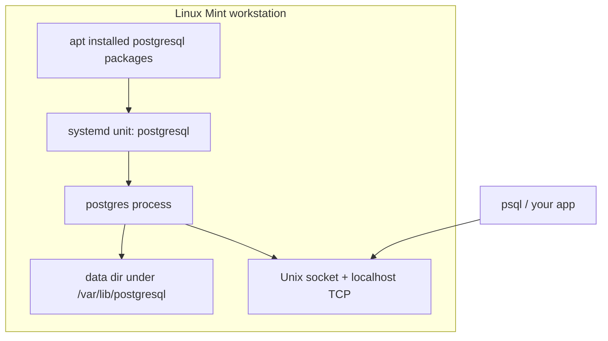

# 5. Setting up a development workstation

[← Running Linux: VMs and containers](04-running-linux.md) · [Home](../README.md) · [Languages →](06-languages.md)

This is the "make the computer useful" chapter. The reference desktop is **Linux Mint Cinnamon edition**. Commands are Debian/Ubuntu-shaped, so they also work on Ubuntu with small naming differences. Fedora notes sit at the end of each major step.

You will:

1. Install Mint from official docs
2. Update the system and learn `apt`
3. Install basic tools
4. Enable an SSH server
5. Turn on UFW
6. Add users and groups
7. Stand up PostgreSQL from scratch
8. Install (or at least bookmark) a real editor and AI coding CLIs
9. Then install compilers and languages in [section 6](06-languages.md)

You can follow this chapter on hardware or inside the [VM from chapter 4](04-running-linux.md). If Mint is already installed in your VM, start at first boot below. Containers do not provide the full desktop and service environment assumed here.

Take snapshots with Timeshift before you get adventurous. Future-you is a harsh code reviewer.

## 5.1 Install Linux Mint Cinnamon

Use the official documents. They are maintained; this paragraph is not a substitute for them.

| Step | Official link |
| --- | --- |
| Pick **Cinnamon edition** | [Download Linux Mint](https://linuxmint.com/download.php) |
| Verify ISO, write USB, live-boot, install | [Linux Mint Installation Guide](https://linuxmint-installation-guide.readthedocs.io/en/latest/) |
| Installer screens | [Install Linux Mint](https://linuxmint-installation-guide.readthedocs.io/en/latest/install.html) |
| After install | [Hardware drivers](https://linuxmint-installation-guide.readthedocs.io/en/latest/drivers.html) · [Timeshift snapshots](https://linuxmint-installation-guide.readthedocs.io/en/latest/timeshift.html) |
| User guide / release notes | [Linux Mint documentation](https://linuxmint.com/documentation.php) |

Practical notes that the installer will not put on a motivational poster:

- **Cinnamon** is the edition with the traditional menu and panel. That is the one this tutorial assumes.
- Connect ethernet or Wi-Fi in the live session so you can tick **multimedia codecs** during install.
- If this machine will *only* run Linux and the disk is empty, "Erase disk and install Linux Mint" is the honest option. Dual boot needs a backup first, not bravery.
- After reboot, open **Driver Manager** if Wi-Fi or graphics look cursed. NVIDIA laptops in particular.

### Same job, other distros

- Ubuntu GNOME: [Install Ubuntu desktop](https://ubuntu.com/tutorials/install-ubuntu-desktop)
- Ubuntu with XFCE / Budgie: [Ubuntu flavors](https://ubuntu.com/desktop/flavours) → [Xubuntu](https://xubuntu.org/), [Ubuntu Budgie](https://ubuntubudgie.org/)
- Fedora Workstation (GNOME): [Download](https://fedoraproject.org/workstation/download) · [Getting started / install](https://docs.fedoraproject.org/en-US/fedora/latest/getting-started/)
- Fedora other desktops: [Fedora Spins](https://fedoraproject.org/spins/)

## 5.2 First boot: become a boring, up-to-date machine

1. Log into Cinnamon.
2. Run **Update Manager** (shield icon) and install everything. Reboot if a kernel landed.
3. Open a terminal (`Ctrl+Alt+T` or Menu → Terminal).
4. Confirm you can use sudo:

```bash
whoami
sudo -v
```

Then follow [Getting started with the Unix shell](https://github.com/amitsk/learning-shell/blob/main/scripts/getting_started.md) until you can create a file with `nano` without googling "how to save."

Mint ships **Timeshift**. After the first successful update, create a snapshot. It is the closest thing Linux has to a save point before a boss fight.

## 5.3 apt: the grocery store

On Mint (and Ubuntu), software is installed with **APT**. `apt` is the friendly frontend; `dpkg` is the low-level unpacker. You almost always want `apt`.

Official references:

- [Ubuntu: Install and manage packages](https://ubuntu.com/server/docs/how-to/software/package-management/)
- `man apt` and `man apt-get` on your machine (always current)

### The loop you will type for the rest of your life

```bash
sudo apt update              # refresh the catalog (does not install upgrades)
apt list --upgradable        # see what would change
sudo apt upgrade             # install available upgrades
sudo apt full-upgrade        # allowed to add/remove packages to finish the upgrade
sudo apt autoremove          # leftover dependencies you no longer need
```

`update` is "download the menu." `upgrade` is "eat the food." Skipping `update` is how you get "package not found" for a package that definitely exists.

### Installing and removing software

```bash
apt search postgresql        # search the catalog
apt show git                 # metadata, version, description
sudo apt install git curl wget build-essential
sudo apt remove some-package      # remove the program, keep config
sudo apt purge some-package       # remove program and its config
```

`build-essential` is compilers and Make — the minimum kit for CS homework that says "just compile it." Make itself is covered in [learning-shell: build systems](https://github.com/amitsk/learning-shell/blob/main/scripts/build_systems.md).

### Where APT looks

- Main lists: `/etc/apt/sources.list` and `/etc/apt/sources.list.d/`
- Mint also uses its own repositories on top of Ubuntu's. Do not mix random PPAs like trading cards.
- Prefer **Update Manager** or `apt` over downloading `.deb` files by hand. A lone `.deb` does not get updates unless it came from a repo.

### apt vs apt-get vs the GUI

| Tool | Use it for |
| --- | --- |
| `apt` | Interactive terminal (this tutorial) |
| `apt-get` / `apt-cache` | Scripts; older docs |
| Update Manager | Clicky upgrades, kernel updates, mintupdate policy |
| Software Manager | Browse apps; often Flatpak |

Mint prefers **Flatpak** for desktop apps that move fast (browsers, IDEs sometimes). APT stays king for system packages: `openssh-server`, `ufw`, `postgresql`, compilers.

**Fedora:** `sudo dnf upgrade --refresh` and `sudo dnf install git`. Docs: [Using DNF](https://docs.fedoraproject.org/en-US/quick-docs/dnf/).

## 5.4 Basic tools and utilities

After the first upgrade:

```bash
sudo apt install \
  git curl wget htop tmux unzip zip \
  build-essential pkg-config \
  ca-certificates gnupg \
  openssh-client
```

Then:

```bash
git --version
git config --global user.name "Your Name"
git config --global user.email "you@example.com"
```

### Terminals

The Cinnamon default (Menu → Terminal, or `Ctrl+Alt+T`) is GNOME Terminal. It works, and it is what this tutorial means when it says "open a terminal."

If you want a faster or more modern emulator, the usual alternatives are [Ghostty](https://ghostty.org/), [Kitty](https://sw.kovidgoyal.net/kitty/), [Alacritty](https://alacritty.org/), and [WezTerm](https://wezfurlong.org/wezterm/). This author uses and recommends **Ghostty** when the machine can support it — it is GPU-accelerated and wants a reasonably recent OpenGL stack. If Ghostty will not launch, keep the default, especially on older laptops ([section 7](07-used-laptops.md)).

Optional but pleasant:

- [starship.rs](https://starship.rs/) — prompt. Also mentioned in [learning-shell](https://github.com/amitsk/learning-shell/blob/main/scripts/getting_started.md)
- [Helix](https://helix-editor.com/) or [Neovim](https://neovim.io/) if you want a terminal editor with opinions
- A browser that is not a group project (Firefox is already there)

Editors (GUI and CLI) are compared in [learning-shell: text editors](https://github.com/amitsk/learning-shell/blob/main/scripts/text_editors.md).

## 5.5 SSH server: so the machine can be a machine

You already have an **SSH client** (`ssh`). An **SSH server** (`sshd`) lets you log *into* this workstation from another computer — laptop in the other room, phone, future-you on a VM.

Ubuntu's guide is the canonical walkthrough (Mint is Ubuntu-family):

- [Ubuntu: OpenSSH server](https://ubuntu.com/server/docs/how-to/security/openssh-server/)
- Client-side keys: [learning-shell: Using SSH](https://github.com/amitsk/learning-shell/blob/main/scripts/getting_started.md#6-using-ssh-to-connect-to-a-remote-server)

### Install and enable

```bash
sudo apt install openssh-server
sudo systemctl enable --now ssh
systemctl status ssh
```

On Ubuntu the unit is often `ssh`; if status says missing, try `sshd`. `systemctl status` is the source of truth.

### First login from another box

```bash
ip -brief addr          # find this machine's LAN IP, e.g. 192.168.1.42
```

From the other computer:

```bash
ssh youruser@192.168.1.42
```

Then set up **key-based auth** using the learning-shell steps (`ssh-keygen`, `ssh-copy-id`). Do not disable passwords until a key login has worked twice.

Keep SSH on the **LAN** unless you know what port forwarding, fail2ban, and "I enjoy being scanned" mean. If you do expose it, keys only, no root login.

**Fedora:** `sudo dnf install openssh-server && sudo systemctl enable --now sshd`

## 5.6 UFW: a firewall you will actually enable

[UFW](https://help.ubuntu.com/community/UFW) (Uncomplicated Firewall) is a frontend to kernel packet filtering. Default desktop Mint may ship it inactive. A workstation that runs `sshd` should not.

```bash
sudo apt install ufw
sudo ufw default deny incoming
sudo ufw default allow outgoing
sudo ufw allow OpenSSH          # or: sudo ufw allow 22/tcp
sudo ufw enable
sudo ufw status verbose
```

`allow OpenSSH` uses the application profile so you do not have to remember 22. If SSH is broken after this, you are either filtering the wrong port or you enabled UFW *before* allowing SSH — in which case you need physical/console access. Order matters. Allow, then enable.

Do **not** `ufw allow 5432` unless you *intend* other machines to talk to PostgreSQL. Local clients use a Unix socket and do not need that hole.

**Fedora:** firewalld instead of UFW. [Firewalld docs](https://docs.fedoraproject.org/en-US/quick-docs/firewalld/). Example: `sudo firewall-cmd --permanent --add-service=ssh && sudo firewall-cmd --reload`

## 5.7 Users and groups

You will add a second user. This is useful for:

- homework vs admin work
- practicing permissions
- running services without inflating your main account

Full conceptual guide (passwd/group files, `id`, `usermod`): [learning-shell: User and Group Management](https://github.com/amitsk/learning-shell/blob/main/scripts/users_groups.md)

On Debian/Mint, prefer `adduser` (interactive, creates a home directory) over raw `useradd`.

```bash
sudo adduser student          # follow the prompts
sudo groupadd cs101
sudo adduser student cs101    # add existing user to a group
id student
groups student
```

Give someone sudo (think twice):

```bash
sudo usermod -aG sudo student
```

The `-a` in `-aG` is "append." Forget it and you replace their group list with one group. That is a rite of passage. It is also annoying.

Switch user to test:

```bash
su - student
pwd
exit
```

## 5.8 PostgreSQL from scratch

Goal: a local PostgreSQL that you created, can log into, and can point an app at. Not a production HA cluster. This exercise installs PostgreSQL as a host service; the container approach in chapter 4 is a separate option.

Official package docs (Mint uses Ubuntu packages):

- [PostgreSQL: Linux downloads — Ubuntu](https://www.postgresql.org/download/linux/ubuntu/)
- [PostgreSQL: Debian](https://www.postgresql.org/download/linux/debian/)
- Optional newer versions: [PGDG apt wiki](https://wiki.postgresql.org/wiki/Apt)

### Install the distro packages

```bash
sudo apt update
sudo apt install postgresql postgresql-contrib
sudo systemctl enable --now postgresql
systemctl status postgresql
```

That starts a server and a default cluster, typically owned by the `postgres` OS user.

### Create a role and a database for *you*

```bash
sudo -u postgres psql
```

Inside `psql`:

```sql
CREATE USER devuser WITH PASSWORD 'change-me-now';
CREATE DATABASE homework OWNER devuser;
GRANT ALL PRIVILEGES ON DATABASE homework TO devuser;
\du
\l
\q
```

Pick a real password. "change-me-now" is a sample, not a lifestyle.

### Connect as that user

Mint/Ubuntu default `pg_hba.conf` uses **peer** auth for local Unix sockets (your OS user must match the DB role) and **scram/md5** for TCP. Easiest first connection for a named role:

```bash
psql -h 127.0.0.1 -U devuser -d homework
```

`-h 127.0.0.1` forces TCP so the password you set actually gets asked. On first connect you may need:

```bash
sudo -u postgres psql -c "ALTER USER devuser WITH PASSWORD 'change-me-now';"
```

Sanity check:

```sql
SELECT version();
CREATE TABLE notes (id serial PRIMARY KEY, body text);
INSERT INTO notes (body) VALUES ('hello from mint');
SELECT * FROM notes;
\q
```

### What you installed, in design terms



Config lives under `/etc/postgresql/<version>/main/` (`postgresql.conf`, `pg_hba.conf`). Logs are in `/var/log/postgresql/`. Restart after config edits:

```bash
sudo systemctl restart postgresql
```

Do not bind PostgreSQL to `0.0.0.0` and do not UFW-open 5432 for fun. Localhost is enough for coursework.

**Fedora:** `sudo dnf install postgresql-server postgresql-contrib` then `sudo postgresql-setup --initdb` and `sudo systemctl enable --now postgresql`. Fedora does **not** always init the cluster on package install — that extra `postgresql-setup` step is the "from scratch" part. See [PostgreSQL on Fedora](https://docs.fedoraproject.org/en-US/quick-docs/postgresql/).

## 5.9 Developer tools: editors and coding agents

Install what you will actually open this semester. Bookmarks count; unused IDEs do not.

### Visual Studio Code

- Linux install: [Visual Studio Code on Linux](https://code.visualstudio.com/docs/setup/linux)
- On Mint/Ubuntu, the Debian `.deb` repo from that page keeps VS Code updated via `apt`.

```bash
# After following Microsoft's repo setup on the page above:
sudo apt install code
```

Language extensions (Python, Java, Go, Rust, C/C++) are listed in [section 6](06-languages.md#vs-code-extensions). Install VS Code here; add plugins after you have a compiler.

### IntelliJ IDEA

- [Install IntelliJ IDEA](https://www.jetbrains.com/help/idea/installation-guide.html)
- [JetBrains Toolbox](https://www.jetbrains.com/toolbox-app/) is the least painful way to install, update, and run IDEA / PyCharm / WebStorm side by side
- Snap (Ubuntu-ish): `sudo snap install intellij-idea-community --classic` — only if you already use snaps. Mint users often prefer Toolbox or a tarball from JetBrains.

Community Edition is enough for Java coursework. Ultimate is a paid product; use what your school licenses.

### AI coding CLIs

These are optional. They are also what a lot of students will be asked about. Official installers change; prefer the docs over copying a `curl | bash` from memory.

| Tool | What it is | Start here |
| --- | --- | --- |
| **Codex** | OpenAI's coding agent / CLI | [Codex product](https://openai.com/codex/) · [Codex CLI docs](https://developers.openai.com/codex/cli/) · [GitHub: openai/codex](https://github.com/openai/codex) |
| **Grok Build** | xAI / SpaceXAI terminal coding agent | [x.ai/build](https://x.ai/build) · [Grok Build docs](https://docs.x.ai/build/overview) · [GitHub: xai-org/grok-build](https://github.com/xai-org/grok-build) |
| **Claude Code** | Anthropic's coding agent | [Claude Code](https://claude.com/product/claude-code) · [Overview](https://code.claude.com/docs/en/overview) · [Quickstart](https://code.claude.com/docs/en/quickstart) |

Typical Linux install commands (verify on the official page before you pipe anything to a shell):

```bash
# Codex CLI — confirm at https://developers.openai.com/codex/cli/
curl -fsSL https://chatgpt.com/codex/install.sh | sh

# Grok Build — confirm at https://docs.x.ai/build/overview
curl -fsSL https://x.ai/cli/install.sh | bash

# Claude Code — confirm at https://code.claude.com/docs/en/quickstart
curl -fsSL https://claude.ai/install.sh | bash
```

Read the script or use the vendor's package when you can. "Curl to bash" is convenient, not a personality.

The learning-shell [text editors](https://github.com/amitsk/learning-shell/blob/main/scripts/text_editors.md) chapter also mentions Vim/Emacs keybindings inside Codex and Grok Build. Once you can exit Vim, you can survive an agent that opens it.

## 5.10 Staying updated without superstition

Software updates are how you receive security fixes. They are not optional extra credit.

### Weekly (or whenever Update Manager nags)

```bash
sudo apt update
sudo apt upgrade
sudo reboot   # if a new kernel or libc landed and the updater says so
```

Mint's **Update Manager** is allowed to be your daily driver. It understands kernels, mintupdate levels, and "this reboot is not a suggestion."

### Know what you are running

```bash
hostnamectl
lsb_release -a
uname -r
apt list --installed | less
```

### Do not

- Disable updates because a blog said they "break everything"
- `chmod -R 777` the project directory to "fix permissions"
- Add every PPA you see on a gist
- Upgrade to a non-LTS Ubuntu mid-semester unless you like grading your own OS

Mint tracks Ubuntu LTS. Stay on the supported release; in-place upgrades have an official path in Mint's release notes when a new LTS lands.

**Fedora:** `sudo dnf upgrade --refresh`. Fedora's cadence is faster; that is the point of Fedora.

## 5.11 A reasonable "done" checklist

```bash
# OS and packages
sudo apt update && sudo apt upgrade

# SSH and firewall
systemctl is-active ssh
sudo ufw status

# You and a practice user
id
id student

# Database
sudo systemctl is-active postgresql
psql -h 127.0.0.1 -U devuser -d homework -c 'SELECT 1'

# Tools
git --version
code --version          # if you installed VS Code
```

If those succeed, you have a workstation. Everything else is customization.

## 5.12 Extra, still useful

- **Languages and compilers:** do not stop at distro `python3`. Use [section 6](06-languages.md) — mise for Java/Python/Node/Go, uv, Cargo, GCC and Clang.
- **Docker:** useful later. Official: [Docker Engine on Ubuntu](https://docs.docker.com/engine/install/ubuntu/). Add your user to the `docker` group only after you understand that it is nearly root.
- **Backups:** Timeshift for the *system*; copy `~/` (projects, `.ssh`, `.gitconfig`) separately. A snapshot of `/` does not replace Git remotes.
- **Shell fluency:** keep going in [learning-shell](https://github.com/amitsk/learning-shell) — HTTP tools, awk, and Make show up in real build logs.

### Other distros, same workstation idea

| Topic | Ubuntu | Fedora |
| --- | --- | --- |
| Install OS | [Ubuntu desktop tutorial](https://ubuntu.com/tutorials/install-ubuntu-desktop) | [Fedora getting started](https://docs.fedoraproject.org/en-US/fedora/latest/getting-started/) |
| Packages | [APT](https://ubuntu.com/server/docs/how-to/software/package-management/) | [DNF](https://docs.fedoraproject.org/en-US/quick-docs/dnf/) |
| SSH | [OpenSSH](https://ubuntu.com/server/docs/how-to/security/openssh-server/) | `openssh-server` + `sshd.service` |
| Firewall | [UFW](https://help.ubuntu.com/community/UFW) | [firewalld](https://docs.fedoraproject.org/en-US/quick-docs/firewalld/) |
| PostgreSQL | [apt packages](https://www.postgresql.org/download/linux/ubuntu/) | [postgresql-setup](https://docs.fedoraproject.org/en-US/quick-docs/postgresql/) |

---

**Next:** [Languages and toolchains →](06-languages.md)
