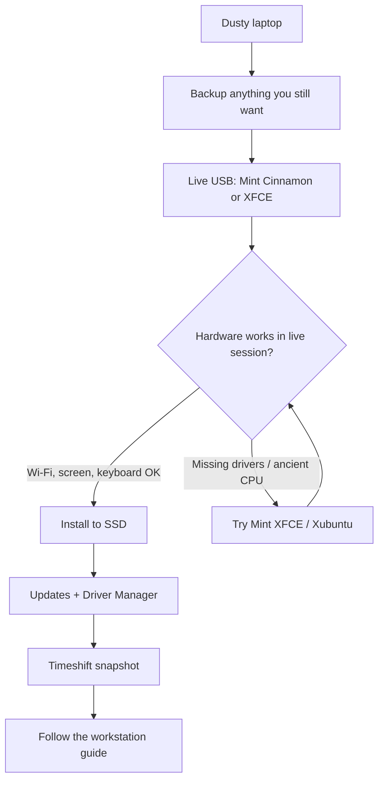

# 5. Used laptops and Linux resurrection

[← Languages and toolchains](04-languages.md) · [Home](../README.md)

Linux is the best reason to buy last year's laptop and the best way to make a 2015 "paperweight" useful again. You do not need a glowing RGB spaceship to compile homework. You need RAM, an SSD, and a kernel that knows the Wi-Fi chip.

This section is shopping advice plus revival advice. Pair it with [Linux Mint Cinnamon](03-dev-workstation.md) on decent hardware, or Mint **XFCE** / [Xubuntu](https://xubuntu.org/) if the machine is tired.

## Why used + Linux is a CS student cheat code

- New laptops charge you for a sticker and a webcam that still looks like 2012.
- Business-class machines from 3–8 years ago have better keyboards, better repair docs, and more RAM slots than a lot of new "thin" consumer laptops.
- Windows 10-era hardware is often *faster* after you remove the OEM antivirus suite and install Linux.
- If you brick the OS, you reinstall. The metal is still yours.

Environmental angle, said once: extending a laptop's life is the greenest upgrade. Then we go back to RAM.

## What actually matters (in order)

| Priority | Target for coursework | Why |
| --- | --- | --- |
| **RAM** | 16 GB if you can; **8 GB minimum** | Browsers eat RAM. IDEs eat RAM. Chromium is a pack animal |
| **Storage** | **NVMe or SATA SSD**, 256 GB+ | A spinning HDD makes Linux feel broken when it is merely old |
| **CPU** | Any 4+ core Intel 8th gen / Ryzen 2000 or newer is plenty | You are compiling CS homework, not training a frontier model |
| **Screen** | 1080p, working hinge | 1366×768 is survivable; your eyes will invoice you |
| **Ports** | USB-A, HDMI or USB-C with video | Dongle tax is real |
| **Battery** | 3+ hours after a wear cycle | Replaceable batteries are a gift. Budget for a new cell |
| **Wi-Fi / Bluetooth** | Intel cards preferred | See "chips that cause grief" below |
| **Firmware** | UEFI, unlockable boot menu | You must be able to boot a USB stick |

GPU is almost irrelevant unless you are doing CUDA coursework. Integrated graphics are fine. NVIDIA on Linux works *better than the memes*, and still worse than "I just wanted Wi-Fi."

## Machines that are boring in the correct way

Look for **business lines**, not last year's gaming slab with a melted keyboard:

- **Lenovo ThinkPad** T, X, and P series (T480, T490, T14, X1 Carbon gens that are a few years old). Keyboards, TrackPoints, parts, and Linux reports in abundance.
- **Dell Latitude** and **HP EliteBook** — similar story. Check the specific Wi-Fi card.
- **Framework** (used) if you want repairability as a product feature: [frame.work](https://frame.work/)
- **Desktop mini PCs** (used ThinkCentre, OptiPlex) if you sit at a desk anyway. Cheap RAM upgrades, loud-but-honest fans.

Skip, or research hard:

- **Macs with Apple silicon** — excellent machines, Linux support is a project ([Asahi Linux](https://asahilinux.org/)), not a first-weekend Mint install.
- **Windows S-mode / locked firmware** school laptops — you may not own the bootloader.
- **No-name specials** with 4 GB soldered RAM and 32 GB eMMC. Linux will install. You will hate it.
- **Very new ultra-light consumer laptops** with Wi-Fi 6E/7 chips that landed last month. Wait for a kernel, or buy Intel Wi-Fi.

Community reports: [Linux Hardware](https://linux-hardware.org/), DistroWatch comments, and `/r/linuxhardware` are more useful than the seller's "runs great!!!"

## Chips that cause grief

| Component | Usually fine | Research before buying |
| --- | --- | --- |
| Wi-Fi | Intel AX/AC cards | Broadcom (common on some Macs and cheap PCs), some MediaTek |
| GPU | Intel, AMD | NVIDIA: installable, extra step ([Mint Driver Manager](https://linuxmint-installation-guide.readthedocs.io/en/latest/)) |
| BIOS | ThinkPad/Latitude firmware | BitLocker leftovers, custom "security" boot, no USB boot |
| Storage | NVMe/SATA SSD | 32 GB eMMC soldered, Intel RST "RAID" mode in firmware |

If the listing photos show a Broadcom Wi-Fi card and you cannot change it, have an ethernet dongle ready for the install.

## Buying checklist (ten minutes in a café)

1. Boot it. Any OS. Confirm the screen, keyboard, trackpad, webcam, speakers, USB ports.
2. If you can, boot a **Linux Mint live USB** on the spot. Wi-Fi, suspend, brightness, and trackpad in the live session are the whole game. Official USB how-to: [Create the bootable media](https://linuxmint-installation-guide.readthedocs.io/en/latest/burn.html).
3. Check RAM and disk: `free -h` and `lsblk` from the live session, or the Windows/macOS about screens.
4. Open the firmware (F1 / F2 / Fn+F2 / Enter+F12 — seller should know). Confirm you can disable Secure Boot if needed and boot USB. Mint's notes: [Boot Linux Mint](https://linuxmint-installation-guide.readthedocs.io/en/latest/boot.html).
5. Battery: unplug it. If it dies in twenty minutes, negotiate the price of a replacement cell, do not pretend it is fine.
6. Ask whether it is **stolen**, **firmware-locked**, or still **MDM / school enrolled**. Walk away from those.

Pay a little more for a machine with an SSD already installed. Swapping a 2.5" SATA disk is easy; some ultrabooks are not.

## Bringing an old laptop back

The ritual is older than some freshmen:

1. **Backup.** Old `Documents/` folders have a way of containing the only copy of something. Copy off the disk first.
2. **Swap HDD → SSD** if the machine still has a spinning disk. This single change does more than a new distro. Clone or just reinstall; reinstall is cleaner.
3. **Max the RAM** if there are empty slots. 2×8 GB is the student sweet spot.
4. **Install Linux Mint.** Cinnamon if the CPU is from the last decade; **XFCE edition** if it wheezes. Guide: [Mint installation](https://linuxmint-installation-guide.readthedocs.io/en/latest/).
5. **First boot:** Update Manager, Driver Manager, then [section 3](03-dev-workstation.md) and [section 4](04-languages.md).
6. **Power:** install `tlp` on older ThinkPads if you care about battery. Mint often feels fine without it; measure before you tune.

If the live USB cannot see the disk, look in firmware for **SATA mode**. RAID/RST often needs to be AHCI for a normal install. Changing that on a disk that still has Windows will make Windows unhappy — another reason to backup and commit.

### How old is too old?

- 64-bit CPU is required for current Mint/Ubuntu/Fedora. 32-bit-only machines are museum pieces. Check with `lscpu` in a live session or the CPU model on the seller page.
- **2 GB RAM** can run XFCE for a terminal and a browser tab. It cannot run "modern web + VS Code + Chrome."
- Pre-UEFI BIOS boxes can still install Linux. They cannot dual-boot with current Windows sanely. Dedicated Linux install, or leave them as a terminal lab.

When the laptop is truly too slow: it can still be a **home SSH box**, a Git remote, or a PostgreSQL toy server sitting on a shelf. That is a respectable retirement.

## Suggested cart for a used workstation

Budget-ish, not a shopping affiliate list:

- Used ThinkPad T-series or Dell Latitude, 16 GB RAM, 256+ GB SSD
- USB installer stick (3.0 if the ports are 3.0)
- Replacement charger from a reputable vendor (cheap no-name bricks start fires)
- Optional: USB ethernet dongle for the first afternoon

Then install Cinnamon or XFCE and go back to [section 3](03-dev-workstation.md) and [section 4](04-languages.md). The hardware is the boring part. The boring part is the point.

## Further reading

- [Linux Mint installation guide](https://linuxmint-installation-guide.readthedocs.io/en/latest/)
- [Xubuntu](https://xubuntu.org/) and [XFCE](https://www.xfce.org/) for light desktops
- [Fedora Spins](https://fedoraproject.org/spins/) if you prefer Fedora on the same hardware
- [learning-shell](https://github.com/amitsk/learning-shell) once the keyboard works

---

[← Languages and toolchains](04-languages.md) · [Back to the start](../README.md)
